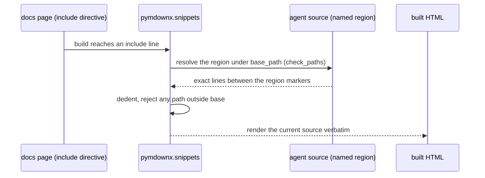
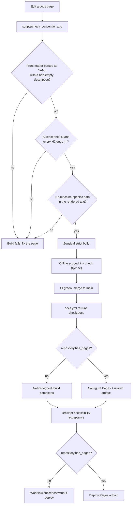

# 8.4. Documentation

!!! abstract "In one glance"

    - **You will:** Preview the course site locally and run the two gates that reject a page with broken front matter, a non-question heading, or a dead link.
    - **You need:** `mise run install` finished.
    - **Time:** about 20 minutes, hands-on.

!!! tip "Start the preview before you read"

    Run `mise run serve` now and keep the preview open at http://localhost:8003 while you read. Every rule below is about something you can see there.

## What builds this site?

This course is a **static site**: Markdown compiled to HTML once, then served as plain files. No server runs at request time. That makes it cheap to host, trivial to cache, and easy to verify — the whole site is a folder you can diff, grep, and link-check.

The generator is Zensical, from the Material for MkDocs authors, pinned exactly in the root [`pyproject.toml`](https://github.com/MLOps-Courses/agentops-open-course/blob/main/pyproject.toml). Read the current pin there; copying an alpha version into prose gives a future maintainer two authorities.

Zensical is pre-1.0, so its rendering can shift between releases. The exact pin plus `uv.lock` freezes the whole build environment. An upgrade is therefore a deliberate bump: rebuild, run the rendered accessibility check, and visually re-inspect the site. `accessibility.js` carries one checked compatibility constant so the search shim cannot silently survive an unreviewed renderer bump.

`mise run serve` runs `zensical serve` for a live-reload preview. `mise run build:docs` writes the static site under `site/`, then materializes the checked historical redirects.

```bash
mise run build:docs
```

## Why is configuration in mkdocs.yml?

Zensical reads MkDocs configuration natively, so one `mkdocs.yml` describes the whole site as data instead of scattering behavior across scripts. Three settings there carry most of the weight, and each defends a specific failure:

1. `strict: true` turns any build warning — a broken nav entry, a missing include, a dead relative link — into a non-zero exit. A site that renders is not enough; it must render clean.
1. The `nav:` tree lists every page explicitly. A new stylesheet, image, or cloud-profile page cannot silently reorder the learning path, because a page that is not in `nav` is not in the site.
1. `use_directory_urls: false` emits `.html` files rather than pretty directory URLs, which keeps the deep links used across the course (and in the publication gate below) stable and greppable.

The file also wires the Material theme features (code copy, tabs, search), the `mermaid` custom fence, `edit_uri` for per-page source links, and the social links. It configures the `pymdownx.snippets` include mechanism covered below too. A header comment records the plan to migrate this to `zensical.toml` once Zensical reaches 1.0; until then, MkDocs configuration is the contract.

## What does the structural checker enforce?

Before Zensical renders anything, `scripts/check_conventions.py` imposes a house style so every page is a self-describing FAQ entry with the same frame. It applies these gates to each `docs/**/*.md` file:

1. The file starts with parseable YAML front matter that defines a non-empty `description`.
1. The file has at least one `##` (H2), and every H2 reads as a question ending in `?`.
1. The file contains no machine-specific path — an absolute path under a user home directory, a `file://` URL, or the retired local container-registry hostname — so the rendered text stays portable across machines.
1. An `!!! abstract "In one glance"` block sits between the H1 and the first H2, carrying **You will**, **You need**, and **Time**, and the Time line names exactly one page kind.
1. The last H2 is the page's exit, spelled one of three fixed ways, and a chapter index labels each sub-page with the kind that page declares for itself.
1. Every collapsible summary starts with `Deeper:`, no page carries more than three, no link label is a bare page number, and every `--8<--` snippet include sits inside a code fence.

The first three keep a page readable on its own. The rest keep the whole course consistent: a learner who builds the reflex on page one should not have to rebuild it later.

The same checker now protects cross-file truth and learner safety. It compares copied pins and exact public task expansions with their manifest owners, rejects unknown documented tasks, and smoke-tests the guarded quickstart. It also requires modifying exercises to declare mode, exact files, dirty preflight, deterministic proof, cleanup, and final state.

Accessibility and route stability are ratchets too. A new or changed Mermaid block needs adjacent `**Diagram in words:**` prose; exact hashes cover only unchanged reviewed legacy diagrams. `docs/released-urls.json` records each minor release's public routes, and a removed route fails unless its redirect reaches a current page without a loop.

**Front matter** is the `---` block at the top of a page that carries its metadata. That first gate is the subtle one, and it exists because of a bug that actually shipped. Three chapter indexes once carried a description like this:

```text
---
description: Make the agent correct and trustworthy: typing, linting, testing, metrics, evaluations, guardrails, and security.
---
```

That is valid-looking prose and invalid YAML: the unquoted `trustworthy: typing` makes the block unparseable. The renderer leaves it alone, and Markdown publishes the whole line as a heading on the rendered page:

```text
description: Make the agent correct and trustworthy: typing, linting, testing, metrics, evaluations, guardrails, and security.
```

One pair of quotes around the value fixes it. The incident is recorded in the `CHANGELOG.md` "Fixed" section.

??? note "Deeper: why the checker parses instead of pattern-matching"

    A textual regex cannot see it; only a real parse can, which is why the checker loads the block with a YAML parser instead of pattern-matching it. That single requirement is why these gates are Python rather than shell:

    ```python
    try:
        meta = yaml.safe_load(match.group(1))
    except yaml.YAMLError as error:
        detail = str(error).splitlines()[0]
        return f"front matter is not valid YAML ({detail}); quote values containing ': '"
    ```

The heading pass is fence-aware: it skips lines inside a code fence, so a `## ...` shown in a code block is not mistaken for a real heading. When a heading fails, the checker names the page and quotes the offending line:

```text
docs/8. Community/8.4. Documentation.md: FAQ heading must end with ?: ## How do you preview and build
```

It prints one such line per offence, keeps checking the remaining pages, and exits non-zero at the end — so `mise run check:docs` stops there and never reaches the Zensical build. The takeaway for authors is mechanical: quote any description that needs a colon, phrase every H2 as a question, and keep local paths out of the prose.

## Why must every heading be a question?

Every H2 is a link target. The FAQ shape is not decoration; it is what makes headings addressable.

Zensical turns every H2 into a URL fragment: its **slug**, the heading lowercased with spaces and punctuation hyphenated. The rest of the course deep-links into those fragments. The glossary in [0.7. Glossary](../0. Overview/0.7. Glossary.md) points terms at specific chapter headings (for example the A2A entry links into `3.6. A2A#...`), and roughly twenty pages carry `.md#slug` cross-references.

A question heading gives each section a stable, human-readable anchor and forces the author to state exactly what the section answers. The checker enforces the surface form; the discipline of not breaking anchors is on the author.

!!! warning "Renaming an H2 breaks every inbound link"

    Renaming an H2 changes its slug and silently breaks every inbound link — nothing in a normal build flags a fragment that no longer exists. So the workflow before rewording an existing heading is: search the docs tree for inbound links to its slug and either keep the wording or update every linking page in the same change. New headings you add carry no such constraint.

## How do course snippets stay identical to the source?

The worst failure mode in technical docs is a code sample that has drifted from the code it claims to show. This course removes the copy entirely: critical examples are pulled from the real source at build time through `pymdownx.snippets`, configured in `mkdocs.yml`:

```yaml
- pymdownx.snippets:
    base_path:
      - .
    check_paths: true
    restrict_base_path: true
    dedent_subsections: true
```

Each setting closes one hole:

1. `base_path: .` roots includes at the repository.
1. `check_paths: true` fails the build if a referenced file or named region is missing — so deleting or renaming a source region cannot leave a stale sample rendering, it breaks the build instead.
1. `restrict_base_path: true` forbids traversal outside the repository, so a page cannot reach arbitrary host files.
1. `dedent_subsections: true` strips indentation from a marked region so a method body renders flush-left.

A page names a source file and a region after a colon. The boundaries live in the source as comment markers (a `start` and matching `end`), so the excerpt is a live window onto the current code:


```mermaid
sequenceDiagram
    participant Page as docs page (include directive)
    participant Snip as pymdownx.snippets
    participant Src as agent source (named region)
    participant Site as built HTML
    Page->>Snip: build reaches an include line
    Snip->>Src: resolve the region under base_path (check_paths)
    Src-->>Snip: exact lines between the region markers
    Snip->>Snip: dedent, reject any path outside base
    Snip-->>Site: render the current source verbatim
```

You can see this working in the deepened chapters: [2.1. First Agent](../2. Agents/2.1. First Agent.md) embeds the `root-agent` region from `composition.py`, and [3.4. Memory](../3. Capabilities/3.4. Memory.md) embeds the `get-runbook` region from `memory.py`.

The rule for authors is the mirror image of the guarantee. Never hand-copy source into a page, and never edit the rendered excerpt: change the source, and the page follows on the next build. When no reusable region fits, copy a short excerpt manually and label it illustrative rather than adding a new marker.

## How do you preview and build?

Four commands cover the whole authoring loop. Start the foreground preview in one terminal:

```bash
mise run serve   # live preview at http://localhost:8003
```

From another terminal, build and run the finite checks:

```bash
mise run build:docs   # static site under site/
mise run check:docs
mise run check:links
```

`mise run check:docs` runs the structural checker and then a full strict Zensical build.

After the build, `scripts/docs_routes.py` generates static redirect pages from the validated release manifest. A rendered pass then checks landmarks, headings, named links, homepage metadata, the custom 404 recovery path, and the dependency-free web client's structural accessibility surface. `scripts/test_check_conventions.py` seeds drifted pins/tasks, an unsafe exercise, a changed diagram, a route rename/loop, and missing rendered metadata so the gate itself has regression evidence.

`mise run check:links` is a separate, offline, scoped gate. It runs **lychee** — a link checker — over an explicit file set: `README.md`, `AGENTS.md`, `CONTRIBUTING.md`, `SECURITY.md`, `CODE_OF_CONDUCT.md`, `ACCESSIBILITY.md`, `GOVERNANCE.md`, `CHANGELOG.md`, and the `docs`, `agents`, `infra`, `skills`, and `scripts` Markdown trees. Offline means it validates repository-local relative links and anchors without reaching the network. It never flakes on a slow external host, and it never silently passes a broken internal link.

Both gates run in CI on every push and pull request as part of `mise run check`.

In the live preview, review desktop and mobile navigation, Mermaid diagrams, tables, code-copy buttons, admonitions, internal links, and long headings in the rendered site. A green checker plus a green link check proves structure and connectivity, not that the prose reads well — read it.

## How do released URLs and unknown routes remain useful?

`docs/released-urls.json` is the URL ledger. Before publishing a minor release, add the sorted route inventory under that version. If a later edit renames, moves, merges, or removes a page, add an old-route → current-route entry instead of deleting the history.

`mise run build:docs` refuses missing targets and redirect loops, then emits a static page at every historical route. Each generated page has a canonical target, an immediate browser redirect, and a named fallback link. Current pages are never overwritten.

A genuinely unknown URL reaches the custom accessible `404.html`, with a heading and named routes back home and to search. That is recovery, not a fake redirect: the server still returns the host's not-found status.

## Which discoverability facts does the site publish?

The documentation templates reuse facts the course already owns: its title, page description, canonical site URL, free-access status, and provider. The homepage exposes those facts through Open Graph and Twitter summary metadata plus one Course JSON-LD record; `robots.txt` allows indexing and points crawlers at the generated sitemap.

The rendered docs gate checks the presence of that metadata without inventing popularity, outcomes, ratings, credentials, or marketing claims. A public release combines this local rendered proof with the online gate below for anonymous repository access, live HTTPS routes, and built-site link resolution.

## What does the Pages workflow actually guarantee?

On a push to `main`, `.github/workflows/docs.yml` installs the pinned mise toolchain and runs `mise run check:docs`. It configures Pages, uploads the artifact, and deploys only when GitHub reports that Pages is enabled for the repository (`github.event.repository.has_pages`); otherwise it records a notice and stops after validation. The end-to-end path from an edit to a published page is a chain of independent gates, each of which can stop it:


```mermaid
flowchart TD
    edit["Edit a docs page"] --> gate["scripts/check_conventions.py"]
    gate --> fm{"Front matter parses as YAML<br/>with a non-empty description?"}
    fm -- no --> stop["Build fails; fix the page"]
    fm -- yes --> hq{"At least one H2 and<br/>every H2 ends in ?"}
    hq -- no --> stop
    hq -- yes --> mp{"No machine-specific path<br/>in the rendered text?"}
    mp -- no --> stop
    mp -- yes --> strict["Zensical strict build"]
    strict --> lynx["Offline scoped link check (lychee)"]
    lynx --> merged["CI green, merge to main"]
    merged --> docs["docs.yml re-runs check:docs"]
    docs --> haspages{"repository.has_pages?"}
    haspages -- no --> skip["Notice logged; build completes"]
    haspages -- yes --> upload["Configure Pages + upload artifact"]
    skip --> access["Browser accessibility acceptance"]
    upload --> access
    access --> deploygate{"repository.has_pages?"}
    deploygate -- no --> done["Workflow succeeds without deploy"]
    deploygate -- yes --> deploy["Deploy Pages artifact"]
```

**Diagram in words:** An edit must pass structural, rendered, and offline-link checks before it merges. The Docs build then conditionally uploads the Pages artifact or records a disabled-Pages notice. Its dependent browser-accessibility job runs next. A Pages-enabled run deploys only after accessibility passes; a disabled one succeeds without deployment.

A green workflow proves the source builds from a clean checkout and passes its browser accessibility acceptance. By itself it does not prove that the repository is anonymously readable, that the configured hostname responds over valid HTTPS, or that the built site's links resolve online. Those are what the publication gate below checks.

## How does the course keep time-sensitive claims fresh?

A pinned version or a cloud price can go stale without breaking a single gate. Passing gates prove a page is well-formed and its code samples are current. They cannot prove that a version number, a model name, a benchmark, or a cloud price is still true.

Those claims rot silently, so the repository schedules a re-verification. `.github/workflows/freshness.yml` runs a quarterly cron: 07:00 UTC on the first of January, April, July, and October. If no freshness audit is already open, it opens exactly one tracking issue from `.github/ISSUE_TEMPLATE/docs-freshness.md`. The idempotence matters: the cron never piles duplicates onto an untriaged issue. A closed, complete audit can qualify multiple releases for up to 120 days; the protected release reviewer can instead approve an explicit one-release waiver reason.

The template is a concrete checklist tied to the files that carry each claim:

1. the default and optional model ids and their licenses;
1. the GKE cost targets and node shapes;
1. the pinned agentgateway and kagent versions and their quirks;
1. the Wolfi and image-digest pins;
1. the measured retrieval checkpoint.

Each item names both the claim and where it lives, so the audit is "open the source, confirm the value still matches reality, check the box or file a fix" rather than a vague reminder. Keep the audit open until every box is checked; the release validator rejects an empty or incomplete checklist. When a claim moves, is added, or is retired, the fix includes updating the template itself, so the checklist tracks the course instead of decaying alongside it.

## What is the publication gate?

Nothing here is yours to run: it checks a domain and a Pages deployment that belong to whoever hosts the site. Read it as the pattern you would copy for a site of your own.

??? note "Deeper: the publication gate, for whoever hosts the site"

    Before the README advertises a hosted course, verify from a clean unauthenticated environment:

    1. Anonymous Git access can resolve `HEAD` and read the repository refs.
    1. GitHub records the exact candidate commit as the newest successful Pages deployment.
    1. The deployed homepage and a deep chapter URL return successful HTTPS responses.
    1. The configured hostname presents a valid certificate.
    1. Repository edit/source links in the built site open without maintainer credentials.
    1. Every other link in the built site passes the documented online link check.

    One reproducible release check is:

    ```bash
    # A throwaway HOME, so no cached credential can make a private repo look public.
    CLEAN_HOME="$(mktemp -d)"
    # Proves anonymous ref access: no system config, no prompt, no credential helper.
    GIT_CONFIG_NOSYSTEM=1 GIT_TERMINAL_PROMPT=0 HOME="$CLEAN_HOME" \
      git -c credential.helper= ls-remote \
      https://github.com/MLOps-Courses/agentops-open-course.git HEAD
    # Discard the throwaway home.
    rmdir "$CLEAN_HOME"

    # Binds this check to the latest Pages deployment recorded by GitHub.
    CANDIDATE_SHA="$(git rev-parse HEAD)"
    DEPLOYMENT="$(
      curl -fsS \
        -H 'Accept: application/vnd.github+json' \
        -H 'X-GitHub-Api-Version: 2022-11-28' \
        'https://api.github.com/repos/MLOps-Courses/agentops-open-course/deployments?environment=github-pages&per_page=1'
    )"
    STATUS_URL="$(
      jq -er --arg sha "$CANDIDATE_SHA" \
        'first(.[] | select(.sha == $sha)).statuses_url' <<<"$DEPLOYMENT"
    )"
    curl -fsS \
      -H 'Accept: application/vnd.github+json' \
      -H 'X-GitHub-Api-Version: 2022-11-28' \
      "$STATUS_URL" |
      jq -e 'length > 0 and .[0].state == "success"' >/dev/null

    # Proves the deployed homepage answers over HTTPS with a valid certificate.
    curl -fsS https://agentops-open-course.fmind.dev/ >/dev/null
    # Proves a deep chapter URL answers, in the .html form use_directory_urls: false emits.
    curl -fsS \
      'https://agentops-open-course.fmind.dev/8.%20Community/8.7.%20Capstone.html' \
      >/dev/null
    # Checks generated file targets on disk and external web targets over the network.
    # --root-dir makes absolute site paths local; the one exclusion is a profile
    # that returns LinkedIn's bot-blocking 999 response to automated clients.
    lychee --no-progress \
      --include-fragments=anchor-only \
      --root-dir "$PWD/site" \
      --exclude '^https://www\.linkedin\.com/in/fmind-dev/?$' \
      --max-concurrency 32 \
      --host-concurrency 4 \
      'site/**/*.html'
    ```

    This is the online counterpart to the offline `mise run check:links`: run it only after `mise run check:docs` has generated `site/`, and note the deep-URL form depends on `use_directory_urls: false`. The GitHub deployment query binds the live checks to the candidate commit instead of accepting a known stale deployment. The exact LinkedIn profile remains a manual browser check because LinkedIn rejects automated clients; every other web and file target stays machine-checked. Email addresses remain outside this gate because automated SMTP probing is not portable. If any command fails, the verified surface remains the local preview and the release is not publication-complete. The [8.2. Releases](./8.2. Releases.md) gate requires this same anonymous check for any publication release.

??? note "Deeper: how is the custom domain declared?"

    `docs/CNAME` and `site_url` in `mkdocs.yml` declare the intended `agentops-open-course.fmind.dev` address. They are configuration, not evidence that DNS or Pages is active: the file names the domain, it does not prove the domain points here. The `curl` checks prove that the configured hostname serves valid HTTPS, but they do not identify its backend. Verify the Pages setting and DNS records separately in their host control planes before first publication or after a domain change.

## What proves this page worked?

```bash
mise run check:docs
mise run check:links
```

Follow all changed pages in the local preview, and confirm critical snippets still render from source. Inspect the generated `site/CNAME`. For a publication release, run the anonymous repository/site/source-link gate above from outside any maintainer-authenticated browser or session, and walk the current freshness-audit issue if one is open. Do not advertise or deploy manually from an unvalidated working tree.

**You are done when:**

- `mise run check:docs` and `mise run check:links` both exit zero.
- The preview at http://localhost:8003 shows every page you changed, with its diagrams, tables, admonitions, and internal links rendering as you meant them.
- Every snippet include on a page you touched shows the current source, not a copy you typed.
- You can say, without rereading, what a page missing a `?` on an H2 prints and why the front-matter gate parses instead of pattern-matching.

Return to [8. Community](./index.md) and pick your next maintenance question when both gates pass on a page you edited yourself. These pages are a lookup, not a sequence.
