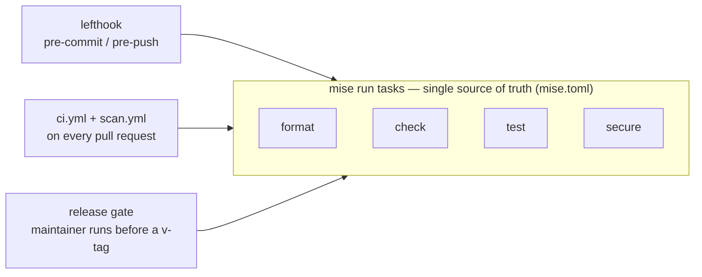
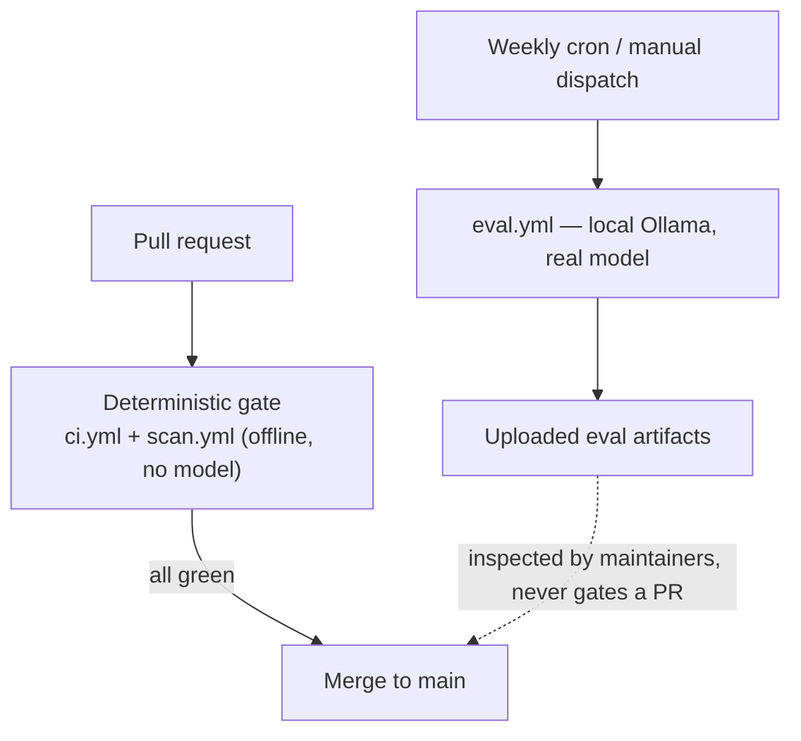

# 8.5. Contributions

## How should you start a contribution?

Two things make external contributions expensive: ambiguity about whether an idea is welcome before you build it, and divergence between what you validate locally and what the maintainer's automation validates. This repository removes both — the first with an issue-versus-PR convention, the second by running one shared task vocabulary everywhere (below).

Read [`CONTRIBUTING.md`](https://github.com/MLOps-Courses/agentops-open-course/blob/main/CONTRIBUTING.md). Open an issue first for a new dependency, an architectural change, or a substantial chapter rewrite so the approach is reviewed before you implement it; a small reproducible fix can go straight to a focused pull request. Set up your fork once:

```bash
mise install
mise run install
```

The first command installs the repository's pinned tools; the second installs the docs and agent dependencies and enables the Git hooks (`lefthook install`). Keep one pull request scoped to one outcome.

The bug, docs, and feature forms under `.github/ISSUE_TEMPLATE/` and the pull-request template collect the sanitized, reproducible detail a reviewer needs (affected area, exact working directory and commands, environment, observed versus expected behavior, learner outcome, upstream license). What each template field enforces is documented in [8.3. Templates](./8.3.%20Templates.md); this page stays on the workflow those templates feed.

## Why do hooks, CI, and releases run the same tasks?

A quality gate is only trustworthy when the thing you run locally is the same thing the reviewer's automation runs. If CI encodes commands that your pre-commit hook does not, "green on my machine" and "green on the PR" drift, and every contributor rediscovers the difference the hard way. The fix is DRY applied to automation: define the checks once, then have every layer delegate to that one definition instead of re-encoding it.

Here that single source of truth is the `mise run` task vocabulary in `mise.toml` (`format`, `check`, `test`, `secure`, and their sub-tasks). Every other layer is a thin caller:

- `lefthook.yml` is deliberately thin — each hook command is literally `mise run <task>`.
- `.github/workflows/ci.yml` runs `mise run install/format/check/test` plus a few named sub-tasks.
- `.github/workflows/scan.yml` runs `mise run secure`.
- The release gate (see [8.2. Releases](./8.2.%20Releases.md)) runs the same four tasks before publishing a tag.
- Even the pull-request template's Test Plan checklist lists `mise run format`, `check`, `test`, and `scan`.



The payoff: to change what "passing" means, you edit one `mise.toml` task, and hooks, CI, and the release gate move together. There is no shadow CI-only script to keep in sync.

## What do local hooks run?

Hooks exist to give fast feedback at the two moments where a mistake is cheapest to catch: before a commit and before a push. `lefthook.yml` sets `parallel: false` on pre-commit so formatters restage their edits (`stage_fixed: true`) before the check step reads the files.

- pre-commit: format staged Markdown and configuration with `mise run format:dprint`, format Python with `mise run format:python`, run the complete `mise run check`, then `mise run secure:staged` (staged-only gitleaks plus a Trivy config scan).
- pre-push: `mise run test`, the offline Python suite that must not call a model or cloud.

The pre-commit `check` is the full `mise run check`, which includes `check:infra` (rendering both Kubernetes overlays). That is thorough but slow; when you only touched docs or Python, iterate with the narrower `mise run check:docs` or `mise run check:core` and let the hook run the full check at commit time.

Hooks are a subset, not the whole gate. `secure:staged` scans only staged changes and configuration — it does not run the full-history secret scan or the container image scans that `scan.yml` runs. Run the complete contributor gate below before you open the pull request, and always review the diff the formatter and lockfiles produced rather than trusting a green hook.

## What does CI run?

Two workflows fire on every pull request, and both are deterministic and offline — no model call, no cloud, no secret beyond the built-in token.

`ci.yml` runs the shared gate and then adds named merge-gate steps so a specific regression surfaces as its own signal instead of one line inside a long run:

1. `mise run install`, `format`, `check`, `test`.
1. `mise run smoke:host` — the account-free host model, MCP, A2A, CORS, and metrics path.
1. `cd agents/python && mise run redteam` — the deterministic adversarial suite (`tests/test_security.py`); this is offline pattern testing, not live-model red-teaming.
1. `cd agents/python && mise run eval:validate` — validates the evalset structure and its seed references (`tests/test_evalset.py`) with no model.
1. `test -z "$(git status --porcelain)"` — fails the build if formatting or a lockfile refresh left an uncommitted edit, forcing generated artifacts to be committed.

The red-team and evalset steps already run inside `mise run test`; the dedicated steps only re-surface a security or evalset regression as a named merge-gate signal.

`scan.yml` runs the security surface: a repository job runs `mise run secure` over full Git history (gitleaks plus Trivy filesystem vulnerability, secret, misconfiguration, and license scans), and a matrix job builds the agent and MLflow images and Trivy-scans them (vulnerabilities and secrets at HIGH/CRITICAL, licenses at UNKNOWN/HIGH/CRITICAL). It also runs weekly.

Documentation is validated on a pull request inside `ci.yml`'s `check` step, which runs `check:docs` (the FAQ structural checker plus a Zensical build). The publish-to-Pages workflow, `docs.yml`, runs only on a push to `main`; see [8.4. Documentation](./8.4.%20Documentation.md) for what it does and does not guarantee.

## What is deliberately not a merge gate?

A merge gate must be deterministic. Anything whose verdict depends on a stochastic model or a slow external substrate cannot block a pull request without making the gate flaky and forcing every fork to hold provider credentials. So this repository draws an explicit line: deterministic checks gate merges, and model-backed evaluation is scheduled evidence you read rather than a gate you must pass.

`.github/workflows/eval.yml` is the model-backed side of that line, and it never gates a pull request:

- It triggers only on `workflow_dispatch` and a weekly cron — never on `pull_request`.
- A repository guard (`if: github.repository == 'MLOps-Courses/agentops-open-course'`) skips it on forks and mirrors, so a contributor's fork never runs an hour of CPU inference or needs a model credential.
- It provisions a local Ollama server on the runner (pinned release and SHA-256), pulls a small open model, and runs the ADK trajectory, structured-report, and MLflow evaluations against the fixed seed data, uploading the logs and `mlflow.db` as artifacts.
- Because a small CPU model can miss an exact tool trajectory, a failure is a signal to inspect the uploaded results, not a merge blocker.

This is the honest engineering line the course teaches in [4.4. Evaluations](../4. Quality/4.4. Evaluations.md): deterministic gates decide whether code merges; model-backed evaluation is evidence a human interprets.



## What is the contributor gate?

Run the same vocabulary CI runs, so a clean local gate predicts a green pull request:

```bash
mise run format
mise run check
mise run test
mise run scan
git status --short
```

Review every formatter, lock, and generated change; remove credentials, model output, and runtime state; and explain any intentional remaining diff. Live-model evaluations are optional and separate from this gate — run them from `agents/python` when behavior changed:

```bash
cd agents/python
mise run eval
mise run eval:mlflow
```

The default `local-ollama` marker path needs no provider credential; hosted paths require their documented authentication. Do not include live-model output or secrets in a pull request.

## How should commits and pull requests be written?

Use a [Conventional Commits](https://www.conventionalcommits.org/) subject (`feat:`, `fix:`, `docs:`, `refactor:`, `chore:`) that describes the outcome. Two enforced conventions are easy to miss:

- No attribution — `CONTRIBUTING.md` forbids generated-by or co-author trailers on commits.
- The changelog is curated from user-visible outcomes, not generated from commit prefixes (see [8.2. Releases](./8.2.%20Releases.md)); a `feat:` subject does not by itself create a changelog line.

The pull-request template asks What, Why, How, and a Test Plan whose checklist mirrors the four gate tasks. Include screenshots only for rendered documentation or UI changes, never terminal output that may contain secrets. The field-by-field structure of the templates lives in [8.3. Templates](./8.3.%20Templates.md).

## Where do security or conduct reports go?

Follow [`SECURITY.md`](https://github.com/MLOps-Courses/agentops-open-course/blob/main/SECURITY.md) for a suspected vulnerability, leaked credential, prompt-injection bypass with real impact, or supply-chain compromise: email the private address with reproduction and impact, and never place exploit details or secrets in a public issue. If you have already committed a secret, `SECURITY.md` is explicit — revoke or rotate it at the provider, remove it from the working tree and history, run `mise run scan` over the full history, and report the exposure privately. Deleting a secret from the latest commit neither revokes it nor removes it from Git history. Community behavior follows [`CODE_OF_CONDUCT.md`](https://github.com/MLOps-Courses/agentops-open-course/blob/main/CODE_OF_CONDUCT.md).

## What is the contribution checkpoint?

Confirm the changed course example matches its source, runs from its documented directory, states its expected output and cleanup, and passes the complete gate. A green test with stale prose is not done; a rendered page with untested code is not done.
