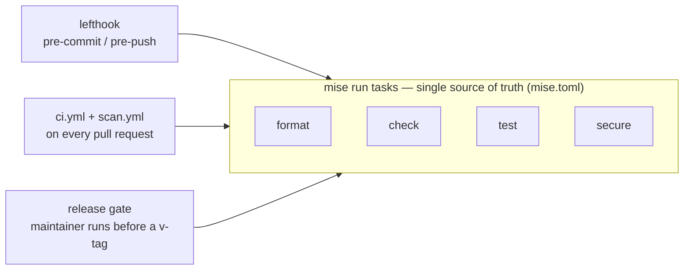
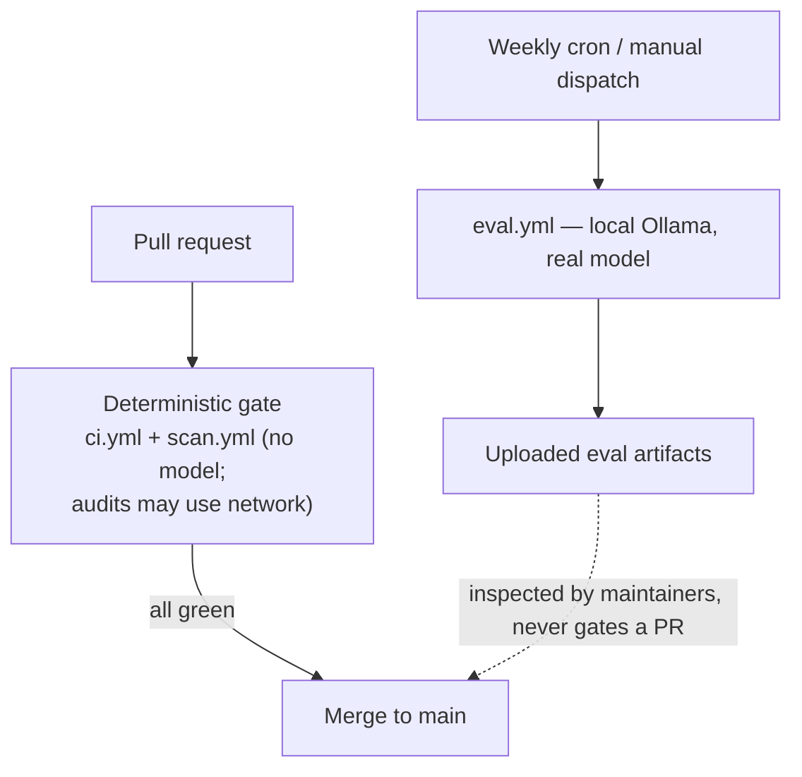

# 8.5. Contributions

!!! abstract "In one glance"

    - **You will:** Set up a fork and run the same four tasks that the git hooks, CI, and the release gate run, so a green local run predicts a green pull request.
    - **You need:** A fork cloned, then `mise run install:maintainer` finished.
    - **Time:** about 22 minutes, hands-on.

## How should you start a contribution?

Clone your fork, then set it up once:

```bash
mise run install:maintainer
```

This installs every pinned contributor tool and locked environment, then enables the Git hooks. Learners use the smaller `mise run install` tier.

Then decide where the change starts:

- **Open an issue first** for a new dependency, an architectural change, or a substantial chapter rewrite, so the approach is reviewed before you implement it.
- **Go straight to a focused pull request** for a small reproducible fix. Keep one pull request scoped to one outcome.

Read [`CONTRIBUTING.md`](https://github.com/MLOps-Courses/agentops-open-course/blob/main/CONTRIBUTING.md) for the full convention. It exists to remove the two things that make external contributions expensive: not knowing whether an idea is welcome, and validating something different locally from what the maintainer's automation validates.

The bug, docs, and feature forms under `.github/ISSUE_TEMPLATE/` and the pull-request template collect the sanitized, reproducible detail a reviewer needs (affected area, exact working directory and commands, environment, observed versus expected behavior, learner outcome, upstream license). What each template field enforces is documented in [8.3. Templates](./8.3.%20Templates.md); this page stays on the workflow those templates feed.

## Why do hooks, CI, and releases run the same tasks?

A quality gate is only trustworthy when the thing you run locally is the same thing the reviewer's automation runs. If CI encodes commands that your pre-commit hook does not, "green on my machine" and "green on the PR" drift, and every contributor rediscovers the difference the hard way. The fix is **DRY** — don't repeat yourself — applied to automation: define the checks once, then have every layer delegate to that one definition instead of re-encoding it.

Here that single source of truth is the `mise run` task vocabulary in `mise.toml` (`format`, `check`, `test`, `secure`, and their sub-tasks). Every other layer is a thin caller:

- `lefthook.yml` is deliberately thin — each hook command is literally `mise run <task>`.
- `.github/workflows/ci.yml` runs `mise run install:maintainer`, then `format`, `check`, and `test` plus a few named sub-tasks.
- `.github/workflows/scan.yml` runs repository and image scans, then publishes one stable `scan` result.
- The release gate (see [8.2. Releases](./8.2.%20Releases.md)) runs the same four tasks before publishing a tag.
- Even the pull-request template's Test Plan checklist lists `mise run format`, `check`, `test`, and `scan`.


```mermaid
flowchart LR
    subgraph tasks["mise run tasks — single source of truth (mise.toml)"]
        F["format"]
        C["check"]
        T["test"]
        S["secure"]
    end
    L["lefthook<br/>pre-commit / pre-push"] --> tasks
    P["ci.yml + scan.yml<br/>on every pull request"] --> tasks
    R["release gate<br/>maintainer runs before a v-tag"] --> tasks
```

The payoff: to change what "passing" means, you edit one `mise.toml` task, and hooks, CI, and the release gate move together. There is no shadow CI-only script to keep in sync.

## What do local hooks run?

Two hooks run automatically: one before every commit, one before every push. They fire at the two moments where a mistake is cheapest to catch.

- pre-commit: format staged Markdown/configuration and Python, run the model-, container-, cluster-, and cloud-free `mise run check:core`, then run `mise run secure:staged`.
- pre-push: `mise run test`, the offline Python suite that must not call a model or cloud.

`lefthook.yml` sets `parallel: false` on pre-commit so the formatters **restage** their edits (`stage_fixed: true`) — put their own changes back into the commit — before the check step reads the files.

The pre-commit hook stays on `check:core` so a commit does not require optional infrastructure tools. Run the complete maintainer gate below before opening a pull request.

Hooks are a subset, not the whole gate. Three tasks scan for secrets and misconfiguration, and each covers different ground:

| Who runs it                        | Task                     | What it covers                                                                               |
| ---------------------------------- | ------------------------ | -------------------------------------------------------------------------------------------- |
| Your pre-commit hook               | `mise run secure:staged` | Staged changes and configuration only: gitleaks on the staged diff plus a Trivy config scan. |
| You, before opening a pull request | `mise run scan`          | The whole repository; `scan` is an alias of `mise run secure`.                               |
| `scan.yml` in CI                   | `mise run secure`        | Full Git history plus the filesystem scans; a second job scans the built images.             |

Run the complete contributor gate at the end of this page before you open the pull request, and always review the diff the formatter and lockfiles produced rather than trusting a green hook.

## What does CI run?

Two workflows fire on every pull request. Both avoid model calls, cloud deployment, and external secrets; dependency, image, and advisory checks still use the network.

`ci.yml` runs the shared gate — `mise run install:maintainer`, `format`, `check`, `test` — and then adds four named **merge-gate** steps: checks that must pass before a pull request can be merged. Naming them separately makes one kind of regression its own signal instead of one line inside a long run.

??? note "Deeper: what `ci.yml` runs, in order"

    1. `mise run install:maintainer`, `format`, `check`, `test`.
    1. `mise run smoke:host` — the account-free host model, MCP, A2A, CORS, and metrics path.
    1. `cd agents/python && mise run redteam` — the deterministic adversarial suite (`tests/test_security.py`); this is offline pattern testing, not live-model red-teaming.
    1. `cd agents/python && mise run eval:validate` — validates the evalset structure and its seed references (`tests/test_evalset.py`) with no model.
    1. `test -z "$(git status --porcelain)"` — fails the build if formatting or a lockfile refresh left an uncommitted edit, forcing generated artifacts to be committed.

    The red-team and evalset steps already run inside `mise run test`; the dedicated steps only re-surface a security or evalset regression as a named merge-gate signal.

`scan.yml` runs the security surface as two jobs, and also runs weekly:

- **Repository job** — `mise run secure` over full Git history: gitleaks plus Trivy filesystem vulnerability, secret, misconfiguration, and license scans.
- **Image jobs** — build, run an import smoke inside, and Trivy-scan the agent and MLflow images.
- **Aggregate job** — reports one stable `scan` status that fails when any repository or image job fails; branch protection requires this context alongside `validate`.

Documentation is validated on a pull request inside `ci.yml`'s `check` step, which runs `check:docs` (the FAQ structural checker plus a Zensical build). The publish-to-Pages workflow, `docs.yml`, runs only on a push to `main`; see [8.4. Documentation](./8.4.%20Documentation.md) for what it does and does not guarantee.

## What is deliberately not a merge gate?

Model-backed evaluation never blocks a pull request in this repository.

A merge gate must be deterministic. A verdict that depends on a model — whose output varies from run to run — or on a slow external service would make the gate flaky, and would force every fork to hold provider credentials. So this repository draws an explicit line: deterministic checks gate merges, and model-backed evaluation is scheduled evidence you read rather than a gate you must pass.

`.github/workflows/eval.yml` is the model-backed side of that line, and it never gates a pull request:

- It triggers only on `workflow_dispatch` (a manual run started from the Actions tab) and a weekly cron — never on `pull_request`.
- A repository guard (`if: github.repository == 'MLOps-Courses/agentops-open-course'`) skips it on forks and mirrors, so a contributor's fork never runs up to two hours of CPU inference or needs a model credential.
- It provisions a local Ollama server on the runner (pinned release and SHA-256), pulls a small open model, and runs six fixed-data evidence paths: ADK trajectory, structured report, bounded workflow, MLflow scorers, cost, and groundedness.
- Because a small CPU model can miss an exact tool trajectory, a failure is a signal to inspect the uploaded results, not a merge blocker.

This is the honest engineering line the course teaches in [4.4. Evaluations](../4. Quality/4.4. Evaluations.md): deterministic gates decide whether code merges; model-backed evaluation is evidence a human interprets.


```mermaid
flowchart TD
    PR["Pull request"] --> gate["Deterministic gate<br/>ci.yml + scan.yml (no model;<br/>audits may use network)"]
    gate -->|"all green"| merge["Merge to main"]
    cron["Weekly cron / manual dispatch"] --> eval["eval.yml — local Ollama, real model"]
    eval --> art["Uploaded eval artifacts"]
    art -. "inspected by maintainers, never gates a PR" .-> merge
```

## How should commits and pull requests be written?

Use a [Conventional Commits](https://www.conventionalcommits.org/) subject (`feat:`, `fix:`, `docs:`, `refactor:`, `chore:`) that describes the outcome. Two enforced conventions are easy to miss:

- No attribution — `CONTRIBUTING.md` forbids generated-by or co-author trailers on commits.
- The changelog is curated from user-visible outcomes, not generated from commit prefixes (see [8.2. Releases](./8.2.%20Releases.md)); a `feat:` subject does not by itself create a changelog line.

The pull-request template asks What, Why, How, and a Test Plan whose checklist mirrors the four gate tasks. Include screenshots only for rendered documentation or UI changes, never terminal output that may contain secrets. The field-by-field structure of the templates lives in [8.3. Templates](./8.3.%20Templates.md).

## Where do security or conduct reports go?

Security reports go to the private address in [`SECURITY.md`](https://github.com/MLOps-Courses/agentops-open-course/blob/main/SECURITY.md), never to a public issue.

Follow it for a suspected vulnerability, leaked credential, prompt-injection bypass with real impact, or supply-chain compromise: email the private address with reproduction and impact, and never place exploit details or secrets in a public issue.

If you have already committed a secret, `SECURITY.md` is explicit:

- Revoke or rotate it at the provider.
- Remove it from the working tree and history.
- Run `mise run scan` over the full history.
- Report the exposure privately.

**Deleting a secret from the latest commit neither revokes it nor removes it from Git history.** Community behavior follows [`CODE_OF_CONDUCT.md`](https://github.com/MLOps-Courses/agentops-open-course/blob/main/CODE_OF_CONDUCT.md).

## How would you take a documentation fix through the gate?

Exercise: turn one page that confused you into a change that is already gate-green before a reviewer sees it.

- **Mode**: `keep`.
- **Goal**: apply the smallest fix that would close a documentation issue against that page, and prove the checks can fail before you trust a green run.
- **Files to touch**: one named page under `docs/` only. `scripts/check_conventions.py` is an authority to read, not an exercise target.
- **Preflight**: before the real fix, require `git diff --quiet -- docs/<chosen-page>.md`. Break one rule, read the expected failure, then use `git restore -- docs/<chosen-page>.md` while the file contains no learner work.
- **Gate that proves completion**: `mise run check:docs` and `mise run check:links` name the offending page and exit non-zero on the deliberate break, then both pass once only your fix remains. Both are offline: no model, no container.
- **Final state**: keep the intentional page fix only; `git status --short` names that page and no deliberate break, generated site file, or unrelated edit.

## What proves this page worked?

Run the same vocabulary CI runs, so a clean local gate predicts a green pull request:

```bash
mise run format
mise run check
mise run test
mise run scan
git status --short
```

Expect minutes, not seconds: `mise run check` renders both Kubernetes overlays and `mise run scan` walks the full Git history. A long quiet stretch is work, not a hang. Each task exits non-zero and names what it rejected, so a failure is never silent.

Review every formatter, lock, and generated change; remove credentials, model output, and runtime state; and explain any intentional remaining diff. Live-model evaluations are optional and separate from this gate — run them from `agents/python` when behavior changed:

```bash
cd agents/python
mise run eval
mise run eval:workflow
mise run eval:mlflow
```

The default `local-ollama` marker path needs no provider credential; hosted paths require their documented authentication. Do not include live-model output or secrets in a pull request.

Then confirm the changed course example matches its source, runs from its documented directory, states its expected output and cleanup, and passes the complete gate.

**You are done when:**

- `mise run format`, `mise run check`, `mise run test`, and `mise run scan` all finish without an error.
- `git status --short` prints nothing after that run.
- You have opened one documentation issue through the `Documentation issue` form (`.github/ISSUE_TEMPLATE/docs.yml`), naming the page and the smallest change that would unblock a reader.
- You can say which of `mise run secure:staged`, `mise run scan`, and `mise run secure` your commit hook ran, and which one CI ran.

A green test with stale prose is not done; a rendered page with untested code is not done.

Return to [8. Community](./index.md) and pick your next maintenance question when your local gate is green and every remaining line of the diff is one you can explain. These pages are a lookup, not a sequence.
