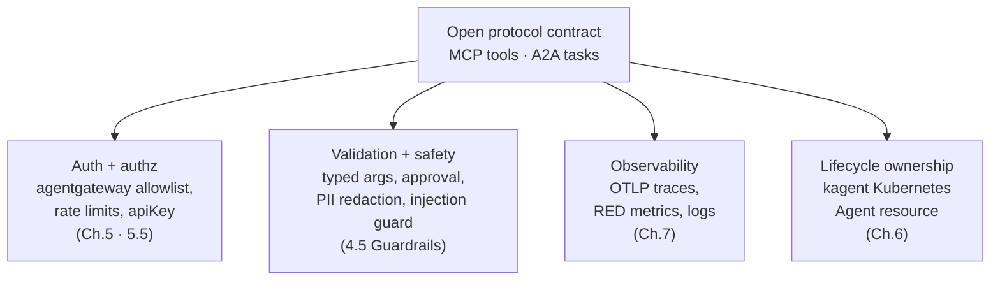
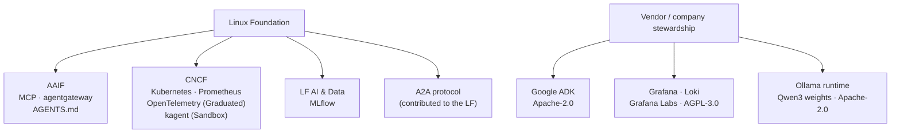

# 8.6. AAIF

## Why does neutral governance matter for an agent stack?

An agent stack is mostly software you did not write and protocols you do not control: the model client, the tool protocol, the agent-to-agent wire format, the router, the metrics format. Whoever _governs_ those contracts decides how they evolve, who is allowed to change them, and whether a competitor's implementation stays interoperable. When one vendor owns a protocol, three risks follow — the contract can drift to suit that vendor's product, your implementation can be pinned to their runtime, and a hostile fork can fragment the ecosystem. Neutral foundation governance is the usual defence: a project donated to an independent foundation gets an open technical charter, a public governing board, and OSI-approved licensing, so the contract evolves in the open across vendors, no single company can unilaterally relicense or redirect it, and multiple implementations can conform to one published spec.

That is why this course prefers foundation-homed contracts at its boundaries — MCP for tools, A2A between agents, OpenTelemetry for signals — over any one vendor's proprietary SDK. But be precise about what governance buys. A neutral home is a governance signal, not a technical guarantee: it does not promise API stability, security, or that two conformant implementations interoperate on the first attempt. So the course does two things at once. It builds on open contracts, and it pins concrete versions and verifies them together. Governance decides _who can change_ a contract; the pins in `AGENTS.md` decide _what you actually run_. This page owns the governance-home question — who stewards each project and why that matters; the complementary "which tool owns which runtime boundary" map is owned by [0.3. Ecosystem](../0.%20Overview/0.3.%20Ecosystem.md).

## What is the AAIF?

The [Agentic AI Foundation](https://aaif.io/) is a Linux Foundation home for open agent infrastructure, formed in December 2025. Its founding contributions were Anthropic's MCP, Block's `goose` agent runtime, and OpenAI's AGENTS.md convention; Solo.io's agentgateway joined in 2026 as the fourth hosted project. Platinum members include the major model and cloud vendors, which is exactly the point: a neutral board and technical committee let competitors co-govern the protocols they all depend on instead of one of them owning the spec.

Foundation governance gives these projects a vendor-neutral place to evolve. It does not by itself guarantee API stability, security, or compatibility with every implementation. Treat AAIF membership as a durability and openness signal, not a version-stability promise — the same caution [0.3. Ecosystem](../0.%20Overview/0.3.%20Ecosystem.md) applies to the `v1alpha2` and pre-2.0 surfaces the course pins.

## Which AAIF projects appear in the course?

Three of the AAIF's four hosted projects are used here; the fourth, `goose`, is not — the course builds its agent on Google ADK instead, which is a good honest reminder that a foundation catalog is a menu, not a mandate.

1. [MCP](https://modelcontextprotocol.io/) is the tool/context client-server contract. The agent reads incidents over MCP; [3.3. MCP](../3.%20Capabilities/3.3.%20MCP.md) implements the server and [5.2. MCP Gateway](../5.%20Gateway/5.2.%20MCP%20Gateway.md) fronts it.
1. [agentgateway](https://agentgateway.dev/) is the open-source Rust data plane that routes MCP, A2A, and OpenAI-compatible model traffic; Chapter 5 owns it end to end.
1. [AGENTS.md](https://agents.md/) is the coding-agent instruction convention, covered in its own answer below.

[A2A](https://a2a-protocol.org/) is closely related but distinct in governance: the Agent2Agent protocol was contributed to the Linux Foundation and is fronted natively by agentgateway, rather than being one of the AAIF's four hosted projects. The course uses it for agent discovery and task exchange ([3.6. A2A](../3.%20Capabilities/3.6.%20A2A.md), [5.3. A2A Gateway](../5.%20Gateway/5.3.%20A2A%20Gateway.md)).

The central caveat is where this page earns its place: an open protocol is a wire contract, not an operational system. MCP says how a tool is discovered and invoked; it does not authenticate the caller, authorize which tools they may use, validate arguments, redact sensitive output, observe the call, or own the workload's lifecycle. Adopting the protocol is the easy part; the operational scaffolding around it is the rest of the course. The course supplies each of those layers around the open protocols:

1. **Authentication and authorization**: agentgateway policies — the six-tool MCP allowlist, per-listener rate limits, and enforced `apiKey` — in [5.5. Gateway Security](../5.%20Gateway/5.5.%20Gateway%20Security.md).
1. **Validation and safety**: typed tool arguments, human approval for writes, PII redaction, and prompt-injection neutralization in [4.5. Guardrails](../4.%20Quality/4.5.%20Guardrails.md).
1. **Observability**: OTLP traces, span-derived RED metrics, and correlated logs across [Chapter 7](../7.%20Observability/7.2.%20Monitoring.md).
1. **Lifecycle ownership**: kagent runs the A2A workload as a Kubernetes `Agent` resource in [6.0. Platform](../6.%20Platform/6.0.%20Platform.md).

## Where does AGENTS.md fit?

[AGENTS.md](https://agents.md/) is a vendor-neutral repository convention that gives coding agents project-local instructions, adopted across many editors and agent tools. It is one of the AAIF's three founding contributions (donated by OpenAI), so it sits in the same neutral-governance landscape as MCP and agentgateway rather than being a private convention. This repository dogfoods it: the root `AGENTS.md` is the operating contract for agents working in the course, and Chapter 1 teaches the convention itself.

Keep one distinction sharp. AGENTS.md is a documentation/instruction standard, not a runtime protocol — no service speaks it. It governs how an agent _edits this repository_, not how the AgentOps Agent serves traffic; that is why it is a foundation-governed convention yet never appears in the network contract. The repository-layout side of the dogfooding is owned by [8.0. Repository](8.0.%20Repository.md).

## Which governance body stewards each part of the stack?

The stack's components sit in four governance homes, and three of them are Linux Foundation sub-foundations — which is why "open governance" recurs across the whole stack:

1. **[AAIF](https://aaif.io/) (Linux Foundation)**: MCP and agentgateway, plus AGENTS.md as a convention. The neutral home for agent protocols and the data plane.
1. **[CNCF](https://www.cncf.io/) (Linux Foundation)**: Kubernetes, Prometheus, and OpenTelemetry are all CNCF _Graduated_ projects (OpenTelemetry reached that top tier in 2026, alongside long-graduated Kubernetes and Prometheus); kagent is a CNCF _Sandbox_ project. Sandbox is the earliest tier — which is exactly why the repo pins kagent's stable chart `0.9.11` and treats its `v1alpha2` API as movable compatibility work.
1. **[LF AI & Data](https://lfaidata.foundation/) (Linux Foundation)**: MLflow, donated by Databricks in 2020 and Apache-2.0, under vendor-neutral open governance.
1. **Vendor / company stewardship (no independent foundation)**: Google ADK (Apache-2.0, published by Google), Grafana and Loki (AGPL-3.0, controlled by Grafana Labs through a contributor licence agreement), the Ollama local runtime, and the Qwen3 open weights (Apache-2.0, from Alibaba). The A2A protocol sits under the Linux Foundation directly rather than any of the three sub-foundations.

The map tells you who can change a contract and under what licence — not whether your pinned version is stable. Even a CNCF Graduated project ships breaking changes across major releases, and the licences differ in ways that matter for your capstone: a permissive Apache-2.0 project (ADK, MLflow, Qwen3, agentgateway) and a copyleft AGPL-3.0 one (Grafana, Loki) impose very different obligations when you redistribute or offer the software as a network service. Read the licence and the pin, not the logo. The coordinated pins live in `AGENTS.md`; the runtime-boundary map is in [0.3. Ecosystem](../0.%20Overview/0.3.%20Ecosystem.md).

## How does the course stay provider-portable?

Portability is only real if it is testable, and "works with any provider" means nothing until you can name the exact contract that stays fixed when the provider changes. Here that contract is the OpenAI-compatible chat-completions interface. The Python agent always uses ADK's OpenAI-compatible client, so moving from a local model to the gateway — or from the gateway to a hosted model — changes only `OPENAI_BASE_URL`. `AGENTS.md` records the invariant: the stable defaults are `AGENT_MODEL_PROVIDER=openai-compatible`, `AGENT_MODEL=qwen3:4b-instruct`, and `OPENAI_BASE_URL=http://127.0.0.1:11434/v1` for direct Ollama, and "Chapter 5 changes only `OPENAI_BASE_URL` to the agentgateway listener" on `:4000`. The mechanics of that swap — and why it survives even a change to Vertex Gemini on GKE — are owned by [5.4. Model Gateway](../5.%20Gateway/5.4.%20Model%20Gateway.md); the open-source-versus-proprietary provider split is owned by [0.4. Providers](../0.%20Overview/0.4.%20Providers.md).

What makes "interoperable" testable rather than aspirational is that every boundary the course crosses is a pinned, open contract — MCP, A2A, OTLP, OCI images, and the Kubernetes API — each fixed to a concrete version: agentgateway `1.3.1`, kagent `0.9.11` on `v1alpha2`, ADK from `2.4.0`, MLflow `3.14.0`, OpenTelemetry Collector contrib `0.156.0`, and Python `3.13`. Portability is verified at those boundaries, not inferred from a slogan: a provider swap is promoted from "reachable" to "supported" only after the recorded eval set passes, because one endpoint standardizes transport, not model behavior. The local backend is Qwen3/Ollama; native Gemini and GKE Vertex/Gemini through Workload Identity Federation are optional proprietary comparisons, never presented as part of the required OSS path.

## How can you contribute upstream responsibly?

When you build on foundation-governed OSS, hitting a bug gives you a choice: carry a local patch forever, or fix it at the source so the whole ecosystem benefits and you stop maintaining a fork. Neutral governance is what makes the second option viable — an open contribution process, a public issue tracker, and a published security policy you can actually follow. Do it cleanly:

1. Reproduce the issue against the project's current supported version, not just your pinned one — a maintainer will ask.
1. Remove course/provider-specific secrets and runtime state, and include a minimal protocol/config example rather than the whole repository.
1. Follow the upstream project's own security and contribution process; never file exploit details or credentials in a public issue.
1. Link any course workaround so others can find it while the upstream fix lands.

The common pitfall is filing at the wrong boundary. A gateway routing bug belongs to agentgateway, a `v1alpha2` schema surprise to kagent, a tool-protocol question to the MCP spec, a trace-export bug to OpenTelemetry — not to this course. Fixing upstream can benefit the ecosystem more than indefinitely carrying a local patch. Improving the course _itself_ is a different, in-repository workflow, owned by [8.5. Contributions](8.5.%20Contributions.md).

## What is the community checkpoint?

Take one real issue and route it with the governance map above: the course repository ([8.5. Contributions](8.5.%20Contributions.md)), the AAIF (MCP or agentgateway), the Linux Foundation (A2A), the CNCF (kagent, Kubernetes, Prometheus, OpenTelemetry), LF AI & Data (MLflow), or a vendor (ADK, Grafana). File it at the narrowest responsible boundary, with sanitized evidence and the exact pinned versions from `AGENTS.md`, and note whether you are carrying a local workaround while the fix lands. Getting the boundary right is the whole skill: it is the same discipline the rest of this stack is built on — one owner per contract, verified where it is pinned.
