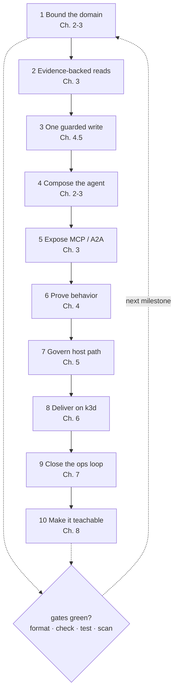

# 8.7. Capstone

## What is the capstone goal?

Create a domain-specific agent platform that preserves the course's open contracts while replacing the fictional AgentOps Agent domain with a problem you understand. Examples include a developer-support agent, data-quality investigator, security triage assistant, or internal platform runbook copilot.

Your required path must remain usable with open-source software and the Apache-2.0 open-weight Qwen3 model: no account, no mandatory SaaS, and no usage fee. Optional hosted models or cloud overlays may be added as clearly labelled comparisons, never as hidden requirements.

This is an extension project, not a file-by-file reconstruction exercise. Start from the completed reference on `main`, create a focused branch, and change one boundary at a time while the existing gates remain green.

## What is your starting state?

Before changing the domain, establish a reproducible baseline:

```bash
mise install
mise run install
mise run doctor
mise run format
mise run check
mise run test
git status --short
```

Record the commit you started from and the passing test/coverage summary. Keep the immutable seed/writable state split: committed input is reproducible, runtime state is disposable, and approved writes never dirty the seed.

Run the reference once on direct Ollama before changing behavior:

```bash
ollama pull qwen3:4b-instruct
mise run doctor:model
cd agents/python
mise run run
```

Ask one read-only question and save the provider, model, prompt, tool trajectory, and result as your baseline evidence.

## Which design decisions must you write down?

Keep the design brief to one page or one pull-request description, but make these decisions explicit:

| Decision         | Question your design must answer                                                                                     |
| ---------------- | -------------------------------------------------------------------------------------------------------------------- |
| User and outcome | Who uses the agent, for which bounded decision, and what should remain deterministic software?                       |
| Domain data      | Which inputs are immutable seed, which state is writable, and which data must never enter model context?             |
| Authority        | Which operations are reads, which are guarded writes, and who can approve each write?                                |
| Model path       | Why is local `qwen3:4b-instruct` sufficient for the required path, and which evaluation would justify another model? |
| Tool boundary    | Which capabilities stay in-process, which cross MCP, and which must never be delegated?                              |
| Agent boundary   | Is one agent enough, or does an A2A/delegation boundary have a measurable ownership benefit?                         |
| Failure policy   | What are the deadlines, retries, budgets, safe errors, and no-fallback cases?                                        |
| Evidence         | Which test, evaluation, trace, metric, and audit record proves the platform works?                                   |

Prefer the smallest platform that satisfies those answers. Adding another framework, database, broker, vector store, or cloud service is not a capstone achievement unless it removes a demonstrated constraint.

## Which files will you normally change?

Use the existing flat ownership boundaries:

| Boundary                  | Typical files                                                                                                       |
| ------------------------- | ------------------------------------------------------------------------------------------------------------------- |
| Immutable domain input    | `agents/data/incidents.db`, `agents/data/sql/`, `agents/data/logs/`, `agents/data/runbooks/`, `agents/data/skills/` |
| Trusted types and state   | `agents/python/src/agent/models.py`, `data.py`, `longterm.py`                                                       |
| Read and knowledge tools  | `tools.py`, `skills.py`, `memory.py`, `retrieval.py`, `mcp_server.py`                                               |
| Guarded writes            | `actions.py`, `guardrails.py`, database schema/triggers                                                             |
| Agent behavior            | `agent.py`, `model.py`, `workflow.py`, `delegation.py`, `report.py`                                                 |
| Quality evidence          | `agents/python/tests/`, `agents/python/evals/`, `load/`                                                             |
| Data plane                | `infra/agentgateway/{host,k3d,gke}/`, `infra/kagent/`                                                               |
| Platform and telemetry    | `infra/k8s/`, `infra/observability/`, `infra/mlflow/`                                                               |
| Learner/operator contract | `README.md`, `AGENTS.md`, relevant `docs/` pages, component READMEs                                                 |

Do not rename every file merely to make the project look new. Rename domain language where it improves clarity; preserve stable protocol and task contracts where they already fit.

## Which milestones should you deliver?

1. **Bound the domain.** Replace or extend the fictional seed with sanitized data, define trusted types, and document one useful user outcome plus one case where deterministic code is better than an agent.
1. **Implement evidence-backed reads.** Add at least one typed read tool and one runbook/skill or retrieval path. Validate identifiers before filesystem/database access and return provenance the model can cite.
1. **Implement one guarded write.** Require explicit confirmation and rationale, validate the target, commit state plus audit evidence in one transaction, and prove update/delete protection on the audit table.
1. **Compose the agent.** Update the instruction, structured report, tool registry, budgets, retries, and safe errors. Keep local Ollama as the default provider and keep imports free of network/destructive work.
1. **Expose open boundaries.** Publish the appropriate reads through MCP, keep writes in-process unless you can preserve confirmation authority, and update A2A discovery for the new capability.
1. **Prove behavior.** Add deterministic unit/integration tests, adversarial cases, and model-backed evaluation cases that check tool trajectories and grounding rather than prose style alone.
1. **Govern the host path.** Update the agentgateway MCP allowlist/policies, run the loopback wrapper, and make `mise run smoke:host` prove MCP, A2A, model, and metrics routes.
1. **Deliver locally on Kubernetes.** Update the image/manifests, deploy to the shared k3d cluster with kagent, verify private ClusterIP/port-forward access, persistence, probes, quotas, and NetworkPolicies.
1. **Close the operations loop.** Produce a trace, useful metric/dashboard view, evaluation result, approved-action audit row, and a scoped cleanup procedure.
1. **Make it teachable.** Update the human and agent documentation so another learner can reproduce the baseline, run one successful path, diagnose a failure, and clean up without private knowledge.

The milestones follow the same lifecycle arc as the course, and each one returns to the repository gate before the next begins:



Each milestone is taught by the chapter labelled on its node — [4.5. Guardrails](../4. Quality/4.5. Guardrails.md) for the guarded write, [Chapter 5](../5. Gateway/index.md) for the host path, [Chapter 6](../6. Platform/index.md) for local delivery, [Chapter 7](../7. Observability/index.md) for the operations loop — so a stalled milestone tells you exactly where to re-read. Commit-sized milestones are easier to review and debug than one final rewrite. Keep each milestone green before starting the next.

## Which contracts should remain stable?

- `AGENT_MODEL_PROVIDER=openai-compatible` with direct Ollama at `http://127.0.0.1:11434/v1` remains the account-free first run.
- Chapter 5 changes `OPENAI_BASE_URL` to `http://127.0.0.1:4000/v1`; provider selection does not double as deployment topology.
- MCP reads use `:3000`, A2A uses `:3001`, the model uses `:4000`, gateway metrics use `:15020`, and host readiness uses `:15021`.
- Immutable seed and writable runtime state remain separate.
- State-changing tools require confirmation and append audit evidence atomically.
- Telemetry content capture remains `false` by default.
- Host listeners are loopback-published through the digest-pinned wrapper; native Linux uses a bridge-scoped relay for loopback backends and Compose's metrics scrape, and Kubernetes services remain private.
- Offline tests never require a model, provider account, cluster, or cloud resource.

You may change a stable contract only when the capstone's outcome requires it. State the incompatibility, migration, updated tests, and learner impact explicitly.

## Which gates prove each layer?

| Layer           | Minimum gate                                                                                                           |
| --------------- | ---------------------------------------------------------------------------------------------------------------------- |
| Repository      | `mise run format`, `mise run check`, `mise run test`, `mise run scan`                                                  |
| Local model     | `mise run doctor:model` plus one recorded read-only trajectory on `qwen3:4b-instruct`                                  |
| Host data plane | `mise run doctor:gateway`, the three host processes, then `mise run smoke:host`                                        |
| Agent behavior  | Deterministic tests plus recorded model-backed eval cases against an explicit model                                    |
| Kubernetes      | `mise run doctor:platform`, both overlay renders, local deployment, readiness, private-service, and persistence checks |
| Observability   | One correlated trace, gateway metric, evaluation run, and audit record                                                 |
| Optional GCP    | `mise run doctor:gcp` and a reviewed `tofu plan`; apply/destroy only with explicit approval                            |

A screenshot is supporting evidence, not a gate. Prefer commands, machine-readable output, tests, traces, and artifact digests that another person can reproduce.

## What evidence should your final submission contain?

Provide one concise handoff with:

- The user problem, non-goals, and architecture/authority decisions.
- The starting and final Git commit identifiers.
- The selected provider/model/base URL and installed Ollama model ID.
- The deterministic test summary and branch-coverage result.
- The evaluation cases, exact tool-trajectory score, and known model failures.
- A sanitized trace identifier or export showing model, tool, and gateway spans.
- A gateway smoke result and the policies/allowlist added for your tools.
- Kubernetes resources, image digest, readiness result, and proof no public service was created.
- One approved write with its confirmation, state change, and audit row.
- Security-scan results, residual risks, and deliberately absent production controls.
- Cleanup commands and confirmation that disposable processes/resources were stopped.

Do not submit credentials, raw sensitive prompts, private logs, `.env`, runtime databases, or generated key material.

## How is the capstone assessed?

| Area                         | Points | Full-credit evidence                                                        |
| ---------------------------- | -----: | --------------------------------------------------------------------------- |
| Problem and architecture     |     10 | Bounded outcome, explicit non-goals, simple ownership boundaries            |
| OSS-first learner path       |     10 | Complete local path with no account, mandatory SaaS, or usage fee           |
| Data and tools               |     15 | Trusted types, provenance, least privilege, seed/state separation           |
| Authority and security       |     15 | Guarded atomic write, audit proof, PII/injection defenses, secret hygiene   |
| Quality                      |     15 | Deterministic tests, at least 95% branch coverage, adversarial regressions  |
| Evaluation                   |     10 | Recorded trajectories, grounding criteria, explicit model/version evidence  |
| Gateway and interoperability |     10 | MCP/A2A/model routes, fail-closed policy, loopback smoke proof              |
| Platform and operations      |     10 | Reproducible local k3d delivery, persistence, private networking, telemetry |
| Documentation and cleanup    |      5 | Reproducible quickstart, diagnosis, limitations, and safe teardown          |

Score the evidence, not the number of tools. A smaller platform with clear authority and reproducible proof should outperform a larger stack with hidden assumptions.

## How do you clean up safely?

Stop host processes and the detached gateway:

```bash
mise run gateway:host:stop
mise run observability:down
(cd agents/python && mise run data:reset)
```

For Kubernetes, confirm the context before removing only the capstone workload:

```bash
test "$(kubectl config current-context)" = k3d-local
cd infra
skaffold delete -p local
```

Do not delete a shared cluster, PVC, cloud resource, or generated evidence until you have reviewed its ownership and retention requirement. An optional GCP plan creates nothing; any approved apply needs a separately reviewed destroy and cost check.

## What is the capstone checkpoint?

Ask another person to follow your documented path from a clean authorized clone. They must be able to pass the base gate, run one grounded local-model request, exercise the governed host route, inspect your evidence, and clean up without asking you for an undocumented credential or step.

Your capstone is complete when that handoff succeeds and the final diff still passes:

```bash
mise run format
mise run check
mise run test
mise run scan
git status --short
```
