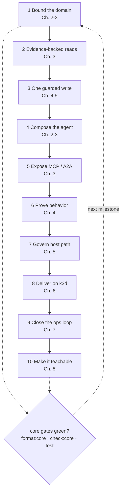

# 8.7. Capstone

!!! abstract "In one glance"

    - **You will:** Turn the reference agent into your own domain agent, one boundary at a time, then prove it reproduces from a clean clone — by a reviewer, or by you on a machine that knows nothing.
    - **You need:** Chapters 1-7 finished and the learner gates passing; later milestones add their own profiles.
    - **Time:** about 60 minutes to plan and measure it; the build itself is open-ended, hands-on.

## What is the capstone goal?

A **capstone** is the closing project you build yourself: one agent, end to end, with this course as the reference.

Create a domain-specific agent platform that preserves the course's open contracts while replacing the fictional AgentOps Agent domain with a problem you understand. Examples include a developer-support agent, data-quality investigator, security triage assistant, or internal platform runbook copilot.

One worked pivot makes the boundaries concrete. To turn the reference into a developer-support agent, thread a single capability through the layout the repository already has:

1. Seed `agents/data/sql/` with `ticket` rows instead of the `INC-*` incidents.
1. Add a typed `get_ticket` read tool in `tools.py` mirroring `get_incident`: validate the id, cite provenance.
1. Re-list `get_ticket` in the MCP allowlist so the gateway will pass it.
1. Add one case to `agents/python/evals/ops.evalset.json` that exercises the new trajectory.

That is one read capability crossing data, tools, gateway policy, and evidence — the same four boundaries every milestone touches.

Scope the work before you start, because the ten milestones below do not all need the same machinery:

- Milestones 1-6 stay on your laptop: the local model and the repository gate, nothing else.
- Milestone 7 needs the host agentgateway of Chapter 5.
- Milestone 8 needs the shared k3d cluster of Chapter 6.
- Milestone 9 needs the telemetry stack of Chapter 7.

Your required path must remain usable with open-source software and the Apache-2.0 open-weight Qwen3 model: no account, no mandatory SaaS, and no usage fee. Optional hosted models or cloud overlays may be added as clearly labelled comparisons, never as hidden requirements.

This is an extension project, not a file-by-file reconstruction exercise. Start from the completed reference on `main`, create a focused branch, and change one boundary at a time while the existing gates remain green.

## What is your starting state?

Before changing the domain, establish a reproducible learner baseline and a clean working tree.

```bash
mise run install
mise run doctor
mise run format:core
mise run check:core
mise run test
git status --short
```

**A passing baseline is:** every task above exits without error, `mise run test` reports its coverage summary, and `git status --short` prints nothing.

Record the commit you started from and the passing test/coverage summary. Keep the immutable seed/writable state split: committed input is reproducible, runtime state is disposable, and approved writes never dirty the seed.

`mise run install` is the complete learner install; do not precede it with bare `mise install`, which would fetch every optional tool. Later milestones each add a scoped install or doctor:

- `mise run doctor:model` for milestones 1-6.
- `cd agents/python && mise run install:eval` for the full evaluation evidence in milestone 6.
- `mise run doctor:gateway` for milestone 7.
- `mise run install:platform` and `mise run doctor:platform` for milestone 8.
- `mise run install:maintainer` before the final all-surfaces gate.

Run the reference once on direct Ollama before changing behavior:

```bash
mise run doctor:model
(cd agents/python && mise run web)
```

Open `http://127.0.0.1:8002`, ask one read-only question, and save the provider, model, prompt, Events trajectory, and result as your baseline evidence. Stop the server with `Ctrl+C`.

## Which design decisions must you write down?

Keep the design brief to one page or one pull-request description, but make these decisions explicit:

| Decision         | Question your design must answer                                                                                     |
| ---------------- | -------------------------------------------------------------------------------------------------------------------- |
| User and outcome | Who uses the agent, for which bounded decision, and what should remain deterministic software?                       |
| Domain data      | Which inputs are immutable seed, which state is writable, and which data must never enter model context?             |
| Authority        | Which operations are reads, which are guarded writes, and who can approve each write?                                |
| Model path       | Why is local `qwen3:4b-instruct` sufficient for the required path, and which evaluation would justify another model? |
| Tool boundary    | Which capabilities stay in-process, which cross MCP, and which must never be delegated?                              |
| Agent boundary   | Is one agent enough, or does an A2A/delegation boundary have a measurable ownership benefit?                         |
| Failure policy   | What are the deadlines, retries, budgets, safe errors, and no-fallback cases?                                        |
| Evidence         | Which test, evaluation, trace, metric, and audit record proves the platform works?                                   |

Prefer the smallest platform that satisfies those answers. Adding another framework, database, broker, vector store, or cloud service is not a capstone achievement unless it removes a demonstrated constraint.

## Which files will you normally change?

Use the existing flat ownership boundaries:

| Boundary                  | Typical files                                                                                                       |
| ------------------------- | ------------------------------------------------------------------------------------------------------------------- |
| Immutable domain input    | `agents/data/incidents.db`, `agents/data/sql/`, `agents/data/logs/`, `agents/data/runbooks/`, `agents/data/skills/` |
| Trusted types and state   | `agents/python/src/agent/models.py`, `data.py`, `longterm.py`                                                       |
| Read and knowledge tools  | `tools.py`, `skills.py`, `memory.py`, `retrieval.py`, `mcp_server.py`                                               |
| Guarded writes            | `actions.py`, `guardrails.py`, database schema/triggers                                                             |
| Agent behavior            | `composition.py`, `model.py`, `workflow.py`, `delegation.py`, `report.py`                                           |
| Quality evidence          | `agents/python/tests/`, `agents/python/evals/`, `load/`                                                             |
| Data plane                | `infra/agentgateway/{host,k3d,gke}/`, `infra/kagent/`                                                               |
| Platform and telemetry    | `infra/k8s/`, `infra/observability/`, `infra/mlflow/`                                                               |
| Learner/operator contract | `README.md`, `AGENTS.md`, relevant `docs/` pages, component READMEs                                                 |

The developer-support pivot from the first section lands in four of those rows: immutable domain input, read tools, data plane, and quality evidence.

Do not rename every file merely to make the project look new. Rename domain language where it improves clarity; preserve stable protocol and task contracts where they already fit.

## What is the dataset contract you must replace?

`agents/data/` is a payload with its own build, its own gate, and no page of its own until this one. Milestone 1 replaces it wholesale, so read its contract before you edit a row.

Four things define it:

- `sql/schema.sql` — the tables the agent reads and writes: `services`, `incidents`, and the append-only `audit_log`.
- `sql/seed.sql` — deterministic rows with fixed ids and timestamps. Fixed values are what make two evaluation runs comparable.
- `incidents.db` — generated from those two files and committed, so a fresh clone answers questions offline.
- `runbooks/*.md`, `logs/*.log`, and `skills/*/SKILL.md` — the files those rows point at.

The database is a build artifact you must not hand-edit. From `agents/data`:

```bash
mise run build   # rm -f incidents.db, then replay schema.sql and seed.sql into it
mise run check   # rebuild into a temporary file, compare, then check four referential rules
```

`check` is not a formality. It enforces the four rules a hand-edited dataset breaks silently:

1. The committed `incidents.db` is byte-for-byte what the SQL produces — with the writer version pinned in `agents/data/mise.toml`, because another `sqlite3` build writes different bytes.
1. Every `incidents.service` value exists in `services`.
1. Every `incidents.runbook` value has a matching `runbooks/<slug>.md`.
1. Every `logs/<name>.log` names a service that exists.

The root task `mise run check:data` runs exactly that, and `mise run check:core` depends on it — so the pre-commit hook already refuses a seed whose database, rows, runbooks, and logs disagree. Your replacement domain inherits that gate the moment your rows land in the same shape.

Two invariants outlive any domain: identifiers are validated against a pattern in `models.py` before anything reads them, and the committed seed is never mutated at runtime — the agent copies it into `AGENT_STATE_DIR` first.

## How do you port the test suite?

Milestone 1 is not a commit-sized change, and its entry gate deserves a current inventory. Measure it in your own clone before you plan anything:

```bash
cd agents/python
rg -l -e 'INC-[0-9]' -e '\b(checkout|payments|inventory|api-gateway|search)\b' tests/test_*.py
```

Do not turn that output into a target of zero. A literal can be the behavior under test—an MCP example, policy target, expected trajectory, or redaction case—rather than duplicated setup. The repository's portability audit counts those explicit examples per file and rejects growth beyond its ratcheted allowance.

- `tests/conftest.py` installs an **autouse** fixture that copies the whole dataset directory for every test, so every test runs against your seed whether it asserts on the domain or not.
- The floor does not move while you work: `mise run test` keeps `--cov-fail-under=95` on branch coverage. Deleting the tests that no longer apply is not a strategy — the floor notices.

Port in this order, running `mise run test` after each step rather than once at the end:

1. **The domain-owned content.** Rewrite `sql/schema.sql`, `sql/seed.sql`, runbooks, logs, and runtime skills, then run the data build and gate. Everything below reads this content, so a seed that changes twice costs you the work twice.
1. **The typed vocabulary.** [`src/agent/domain.py`](https://github.com/MLOps-Courses/agentops-open-course/blob/main/agents/python/src/agent/domain.py) owns `DomainVocabulary` with `incidents`, `services`, `runbooks`, and `dependency_edges`; `REFERENCE_DOMAIN` owns the reference names. Test support in [`tests/domain.py`](https://github.com/MLOps-Courses/agentops-open-course/blob/main/agents/python/tests/domain.py) owns `PIVOT_DOMAIN` and `adapt_dataset`, proving a copied seed and its files can cross that one adapter surface. Replace the production vocabulary for generic setup while keeping behavior-specific literals visible where they are asserted.
1. **The validators.** `models.py` pins `^INC-\d+$` for incident ids and a lowercase slug pattern for services and runbooks. If your identifiers are `TCK-1024` or a UUID, change the pattern here before touching a tool: every read tool, the structured report, and the MCP schema inherit it.
1. **The boundary evidence.** `test_domain_portability.py` exercises the reference and pivot vocabulary across reads, guarded writes, protocol, policy, and evaluation validation. The eval-set JSON files still carry domain prompts and expected trajectories; change them only after the seed and vocabulary are stable.

The adapter is intentionally test support, not a project generator or a promise that every domain has the same schema. It exposes the coupling the reference already knows about and gives the ratchet one owner. Your production types, tools, seed, and evidence still need deliberate domain design.

## Your turn: how do you prove the domain coupling before milestone 1?

Required drill — the [Chapter 8 checkpoint](./index.md#what-proves-this-chapter-worked) asks for its result. Break one seed row and let the suite show you the blast radius, instead of planning a port around a guess.

- **Mode**: `temporary experiment`.
- **Goal**: change exactly one identifier in the seed, rebuild the database, and read which tests fail and why. You are measuring coupling here, not fixing anything.
- **Files to touch**: `agents/data/sql/seed.sql` and the generated `agents/data/incidents.db` — rename one incident id, for example `INC-002` to `INC-902` — then `cd agents/data && mise run build`, because the tests read the generated database and not the SQL.
- **Preflight**: require `git diff --quiet -- agents/data/sql/seed.sql agents/data/incidents.db`; both are experiment targets because the build regenerates the database.
- **Gate that proves completion**: `cd agents/python && uv run pytest -q` now fails, and the failures name the identifier you changed rather than an unrelated stack.
- **Final state**: from the repository root, run `git restore -- agents/data/sql/seed.sql agents/data/incidents.db`, then confirm `cd agents/python && uv run pytest -q` and root `mise run check:data` are green. The focused `git diff --quiet --` preflight must pass again.

## Which milestones should you deliver?

Ten milestones, in order. Each has one signal that tells you it is finished; milestone 1 is a multi-commit port, and the nine after it are commit-sized.

1. **Bound the domain.** The largest milestone by far: replace domain-owned content, update the typed vocabulary and validators, then review every ratcheted literal the portability audit reports. _Done when_ your sanitized seed passes `mise run check:data`, the reference/pivot portability checks pass for your vocabulary, no unexplained domain term exceeds the ratcheted allowance, and `mise run test` is green at the unchanged 95% branch floor. Document one useful user outcome plus one case where deterministic code is better than an agent.
1. **Implement evidence-backed reads.** _Done when_ one typed read tool returns a record with its **provenance** — the source the model can cite — and an invalid identifier is refused by a test. Add at least one typed read tool and one runbook/skill or retrieval path, and validate identifiers before filesystem/database access.
1. **Implement one guarded write.** _Done when_ a write without confirmation fails a test, and an `UPDATE` or `DELETE` against the audit table is rejected. Require explicit confirmation and rationale, validate the target, and commit state plus audit evidence in one transaction.
1. **Compose the agent.** _Done when_ `mise run web` answers your own domain question on local Ollama and its Events timeline shows the tools you registered. Update the instruction, structured report, tool registry, budgets, retries, and safe errors. Keep local Ollama as the default provider and keep imports free of network/destructive work.
1. **Expose open boundaries.** _Done when_ your new read is listed by your MCP server and by the A2A agent card. Publish the appropriate reads through MCP, and keep writes in-process unless you can preserve confirmation authority.
1. **Prove behavior.** _Done when_ `mise run test` and your model-backed evaluation cases both pass, including at least one adversarial case. Those cases check tool trajectories and grounding rather than prose style alone.
1. **Govern the host path.** _Done when_ `mise run smoke:host` proves the MCP, A2A, model, and metrics routes against your own policies. Update the agentgateway MCP allowlist/policies and run the loopback wrapper.
1. **Deliver locally on Kubernetes.** _Done when_ your workload is Ready on the shared k3d cluster and no public service exists. Update the image/manifests, deploy with kagent, and verify private ClusterIP/port-forward access, persistence, probes, quotas, and NetworkPolicies.
1. **Close the operations loop.** _Done when_ one request leaves a trace, a useful metric/dashboard view, an evaluation result, and an approved-action audit row you can point at. Write the scoped cleanup procedure alongside them.
1. **Make it teachable.** _Done when_ another learner can reproduce the baseline, run one successful path, diagnose a failure, and clean up without private knowledge. Update the human and agent documentation until that is true.

The milestones follow the same lifecycle arc as the course, and each one returns to the repository gate before the next begins:


```mermaid
flowchart TD
    M1["1 Bound the domain<br/>Ch. 2-3"] --> M2["2 Evidence-backed reads<br/>Ch. 3"]
    M2 --> M3["3 One guarded write<br/>Ch. 4.5"]
    M3 --> M4["4 Compose the agent<br/>Ch. 2-3"]
    M4 --> M5["5 Expose MCP / A2A<br/>Ch. 3"]
    M5 --> M6["6 Prove behavior<br/>Ch. 4"]
    M6 --> M7["7 Govern host path<br/>Ch. 5"]
    M7 --> M8["8 Deliver on k3d<br/>Ch. 6"]
    M8 --> M9["9 Close the ops loop<br/>Ch. 7"]
    M9 --> M10["10 Make it teachable<br/>Ch. 8"]
    Gate{"core gates green?<br/>format:core · check:core · test"}
    M1 -.-> Gate
    M10 -.-> Gate
    Gate -.next milestone.-> M1
```

Each milestone is taught by the chapter labelled on its node, so a stalled milestone tells you exactly where to re-read: milestone 3 in [4.5. Guardrails](../4. Quality/4.5. Guardrails.md) for the guarded write, milestone 7 in [Chapter 5](../5. Gateway/index.md) for the host path, milestone 8 in [Chapter 6](../6. Platform/index.md) for local delivery, and milestone 9 in [Chapter 7](../7. Observability/index.md) for the operations loop. Keep the core gate green after every milestone, then add the relevant runtime proof. Run the full maintainer gate before the final handoff.

## Which contracts should remain stable?

Four things stay put unless you have a reason: the account-free local model path, the port map, the seed/state split, and confirmation plus audit on every write.

??? note "Deeper: the eight contracts, in full"

    - `AGENT_MODEL_PROVIDER=openai-compatible` with direct Ollama at `http://127.0.0.1:11434/v1` remains the account-free first run.
    - Chapter 5 changes `OPENAI_BASE_URL` to `http://127.0.0.1:4000/v1`; provider selection does not double as deployment topology.
    - MCP reads use `:3000`, A2A uses `:3001`, the model uses `:4000`, gateway metrics use `:15020`, and host readiness uses `:15021`.
    - Immutable seed and writable runtime state remain separate.
    - State-changing tools require confirmation and append audit evidence atomically.
    - Telemetry content capture remains `false` by default.
    - Host listeners are loopback-published through the digest-pinned wrapper; native Linux uses a bridge-scoped relay for loopback backends and Compose's metrics scrape, and Kubernetes services remain private.
    - Offline tests never require a model, provider account, cluster, or cloud resource.

You may change a stable contract only when the capstone's outcome requires it. State the incompatibility, migration, updated tests, and learner impact explicitly.

## Which gates prove each layer?

Every layer you claim has one minimum gate. Run the row before you write the claim down.

| Layer              | Minimum gate                                                                                                           |
| ------------------ | ---------------------------------------------------------------------------------------------------------------------- |
| Learner repository | `mise run format:core`, `mise run check:core`, `mise run test`                                                         |
| Final repository   | `mise run install:maintainer`, then `mise run format`, `mise run check`, `mise run test`, and `mise run scan`          |
| Local model        | `mise run doctor:model` plus one recorded read-only trajectory on `qwen3:4b-instruct`                                  |
| Host data plane    | `mise run doctor:gateway`, the three host processes, then `mise run smoke:host`                                        |
| Agent behavior     | Deterministic tests plus recorded model-backed eval cases against an explicit model                                    |
| Kubernetes         | `mise run doctor:platform`, both overlay renders, local deployment, readiness, private-service, and persistence checks |
| Observability      | One correlated trace, gateway metric, evaluation run, and audit record                                                 |
| Optional GCP       | `mise run doctor:gcp` and a reviewed `tofu plan`; apply/destroy only with explicit approval                            |

A screenshot is supporting evidence, not a gate. Prefer commands, machine-readable output, tests, traces, and artifact digests that another person can reproduce.

## What evidence should your final submission contain?

One concise handoff document: what you built, the commits, and the artifact for every layer you claimed above.

??? note "Deeper: the eleven items the handoff lists"

    Provide one concise handoff with:

    - The user problem, non-goals, and architecture/authority decisions.
    - The starting and final Git commit identifiers.
    - The selected provider/model/base URL and installed Ollama model ID.
    - The deterministic test summary and branch-coverage result.
    - The evaluation cases, exact tool-trajectory score, and known model failures.
    - A sanitized trace identifier or export showing model, tool, and gateway spans.
    - A gateway smoke result and the policies/allowlist added for your tools.
    - Kubernetes resources, image digest, readiness result, and proof no public service was created.
    - One approved write with its confirmation, state change, and audit row.
    - Security-scan results, residual risks, and deliberately absent production controls.
    - Cleanup commands and confirmation that disposable processes/resources were stopped.

Do not submit credentials, raw sensitive prompts, private logs, `.env`, runtime databases, or generated key material.

For an optional portfolio handoff, keep the document to six short sections:

1. **Architecture:** one diagram plus the user, trust, data, and approval boundaries in words.
1. **Exact commands:** the clean-clone install, gate, demo, and cleanup commands you actually ran.
1. **Evaluation lineage:** source revision, dataset/eval-set digests, provider and model identity, and the recorded result.
1. **Trace and audit evidence:** sanitized identifiers that connect one request to its tool spans and approved write.
1. **Limitations:** unsupported platforms, absent production controls, known model failures, and residual risks.
1. **Short demo:** one bounded success and one diagnosed failure; link reproducible evidence rather than only a video.

## How do you make the offline evidence independently verifiable?

The repository can create a small local manifest after your tracked changes are committed and the working tree is clean:

```bash
mise run course:evidence
```

The command reruns `check:core` and `test`, then writes `.agents/tmp/course-completion.json`. It records the exact Git revision, the fixed gate inventory, and SHA-256 digests of the locks, seed database, and evaluation set. It deliberately records no command output, environment values, prompts, runtime databases, credentials, or telemetry.

Give that JSON file to a reviewer who has checked out its exact revision. From that clean clone, the reviewer runs:

```bash
mise run course:evidence:verify -- /path/to/course-completion.json
```

Verification rejects a different revision, tracked or untracked source changes, changed artifacts, or a changed gate inventory, then reruns both deterministic gates. This is reproducible local evidence, not an identity proof, certificate, hosted grader, or claim about model, gateway, Kubernetes, observability, or cloud results.

## How is the capstone assessed?

Nobody grades this but you, or a reviewer you choose. Use the rubric below as a self-review checklist and read its points as weights.

Score the evidence, not the number of tools. A smaller platform with clear authority and reproducible proof should outperform a larger stack with hidden assumptions.

??? note "Deeper: the hundred-point self-review rubric"

    | Area                         | Points | Full-credit evidence                                                        |
    | ---------------------------- | -----: | --------------------------------------------------------------------------- |
    | Problem and architecture     |     10 | Bounded outcome, explicit non-goals, simple ownership boundaries            |
    | OSS-first learner path       |     10 | Complete local path with no account, mandatory SaaS, or usage fee           |
    | Data and tools               |     15 | Trusted types, provenance, least privilege, seed/state separation           |
    | Authority and security       |     15 | Guarded atomic write, audit proof, PII/injection defenses, secret hygiene   |
    | Quality                      |     15 | Deterministic tests, at least 95% branch coverage, adversarial regressions  |
    | Evaluation                   |     10 | Recorded trajectories, grounding criteria, explicit model/version evidence  |
    | Gateway and interoperability |     10 | MCP/A2A/model routes, fail-closed policy, loopback smoke proof              |
    | Platform and operations      |     10 | Reproducible local k3d delivery, persistence, private networking, telemetry |
    | Documentation and cleanup    |      5 | Reproducible quickstart, diagnosis, limitations, and safe teardown          |

## How do you clean up safely?

Stop host processes and the detached gateway:

```bash
mise run gateway:host:stop
mise run observability:down
(cd agents/python && mise run data:reset)
```

For Kubernetes, confirm the context before removing only the capstone workload:

```bash
test "$(kubectl config current-context)" = k3d-local
(
  cd infra
  skaffold delete --filename skaffold.yaml --profile local
)
```

Do not delete a shared cluster, PVC, cloud resource, or generated evidence until you have reviewed its ownership and retention requirement. An optional GCP plan creates nothing; any approved apply needs a separately reviewed destroy and cost check.

## What proves this page worked?

The strongest proof is another person. Ask them to follow your documented path from a clean authorized clone: pass the base gate, run one grounded local-model request, exercise the governed host route, inspect your evidence, and clean up — without asking you for an undocumented credential or step.

This course is self-paced and account-free, so it owes you a version you can finish alone. The solo handoff tests the same claim — that your instructions, not your machine, carry the knowledge:

1. Clone your repository into a directory you have never worked in. A clean `HOME`, a fresh user, or a container is stronger, because it also drops your shell configuration and your tool caches.
1. Carry nothing across: no `.env`, no `.state/`, no hand-copied caches, no shell history. Whatever your documentation does not name, you do not have.
1. Type only commands your own README and pages contain. The moment a step fails or needs something unwritten, stop, fix the documentation, and restart the run from the top.
1. Finish the reviewer's path: gate, one grounded request, the governed host route, the evidence, cleanup.

The one failure a solo run cannot catch is the one you can name in advance: you already know what your own words mean. So when a reviewer is available, use them — that is the stronger evidence. One of the two runs is the terminal gate, and skipping both is not an option.

Your capstone is complete when that handoff succeeds and the final diff still passes:

```bash
mise run install:maintainer
mise run format
mise run check
mise run test
mise run scan
git status --short
```

**You are done when:**

- The five `mise` tasks above pass and `git status --short` prints nothing.
- A matching clean clone accepts the local completion manifest with `mise run course:evidence:verify`.
- Every milestone you claim has its done-signal met, not just a description written.
- One request of your own left a trace, an evaluation result, and an audit row you can show.
- The coupling drill ran and left nothing behind: the suite went red on your one seed edit and green again after `git restore` plus a rebuild.
- `mise run check:data` passes against your own seed, and `rg 'INC-' agents/python/` returns nothing.
- Either a reviewer or a from-scratch clone with nothing carried over finished the whole path — baseline, grounded request, host route, cleanup — without an undocumented question or an unwritten step.

Continue to [the optional OSS maintenance tour](./8.0.%20Repository.md) when you plan to publish or sustain the result, or return to [the course home](../index.md).
