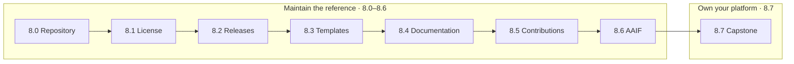

# 8. Community

## Why is sustainability the final stage of the AgentOps lifecycle?

[Chapter 7](../7. Observability/) left you with an agent that is not only running but observable — you can trace one turn, watch its health, cost the work, and audit every approved write. That is where operating an agent stops and _sustaining a project_ begins. An agent nobody but you can rebuild, relicense, release, or safely extend is a private artifact, not an operated system; the [AgentOps loop](../0. Overview/0.2. AgentOps.md) only closes if the people who inherit the code can keep it green.

That is why community is the last node in the lifecycle rather than a soft epilogue. The reference on `main` is deliberately a _completed, executable_ project — `AGENTS.md` insists it "must not drift into a collection of illustrative snippets" — so this chapter shows the load-bearing machinery that keeps it that way: a legible layout, an honest license split, evidence-backed releases, a reusable template, self-checking docs, a contribution gate, and a place in the wider open ecosystem. None of it is agent-specific glamour; all of it is what makes the previous seven chapters reproducible by someone other than the author.

## How does this chapter move from the reference project to your own?

The chapter has two halves. Pages 8.0–8.6 are a _maintenance tour of this reference_ — how the repository you have been reading is organized, licensed, released, templated, documented, and contributed to. Page 8.7 is the _handoff_: the capstone turns that reference into a platform you own for a domain you understand, keeping the same contracts while replacing the fictional incident domain.



The order is not alphabetical; each page assumes the one before it:

| Page                                          | What it covers                                                                                                   | Why it sits here                                                   |
| --------------------------------------------- | ---------------------------------------------------------------------------------------------------------------- | ------------------------------------------------------------------ |
| [8.0. Repository](./8.0. Repository.md)       | The top-level layout and the README (humans) vs AGENTS.md (agents) split                                         | You need the map before you can maintain anything                  |
| [8.1. License](./8.1. License.md)             | The dual license — CC-BY-4.0 for the prose, MIT for the code — and how to attribute both                         | Know what you may release and reuse before you release or reuse it |
| [8.2. Releases](./8.2. Releases.md)           | Deliberate SemVer, a curated Keep a Changelog history, gates, tags, and release evidence                         | A license makes a release shareable; now cut one                   |
| [8.3. Templates](./8.3. Templates.md)         | Extracting a reusable OSS generator without copying secrets, data, identity, or cloud assumptions                | Once you can release, you can factor the shape out for reuse       |
| [8.4. Documentation](./8.4. Documentation.md) | Pinned Zensical, the FAQ structure `scripts/check-docs.sh` enforces, snippet mirroring, and safe publishing      | The maintenance loop that keeps prose honest and reproducible      |
| [8.5. Contributions](./8.5. Contributions.md) | Issue/PR hygiene and the same format/check/test/scan tasks used by hooks and CI                                  | How anyone else changes the repo without breaking a gate           |
| [8.6. AAIF](./8.6. AAIF.md)                   | Where MCP, A2A, agentgateway, and kagent sit under the AAIF and CNCF, and how to contribute upstream             | Situate the stack in the ecosystem that maintains it beyond you    |
| [8.7. Capstone](./8.7. Capstone.md)           | Replace the fictional domain while preserving the OSS-first, authority, quality, gateway, and evidence contracts | The handoff: turn the reference into your own platform             |

Every maintenance page in the first half acts on the same payloads the repository ships — chiefly `docs/` (the course prose), `agents/` (the reference agent and its immutable seed), and `infra/` (the data plane and platform) — and defers to the one shared `mise` task vocabulary, so a license note, a docs edit, and a code change are all proven the same way. Chapter 8.7 is the only page that expects you to change all three at once.

## What is the chapter checkpoint?

This chapter starts no service and tears nothing down; its subject is the project around the agent, not a runtime. Its checkpoint is therefore the same gate every maintenance and contribution task defers to — the one another person must be able to pass on a fork of your work:

```bash
mise run format
mise run check
mise run test
mise run scan
```

You have finished the chapter when you can read the repository map, cite the correct license for a given file, name what one CI gate protects, and — the real bar — hand your [capstone](./8.7. Capstone.md) to another person who reproduces it from a clean clone without asking you for an undocumented step.
