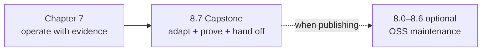

# 8. Community

!!! abstract "In one glance"

    - **You will:** Start the capstone directly and know which optional page to use when you maintain an open-source project.
    - **You need:** Part I completed for the developer capstone, or Chapters 1-7 for the platform capstone.
    - **Time:** about 6 minutes, orientation.

## What should you do after Chapter 7?

Go directly to [8.7. Capstone](./8.7.%20Capstone.md). It turns the completed reference into an agent for a domain you understand, then proves the result reproduces from a clean clone — handed to a reviewer, or run by you on a machine that carries nothing over.

[Chapter 7](../7.%20Observability/) left you with the evidence needed to make that change responsibly: tests, trajectories, gateway policy, deployment checks, traces, metrics, and audit records. The capstone is where those pieces become one learner-owned platform.

Pages 8.0-8.6 are optional OSS maintenance references. Read one when you need to organize, license, release, document, or contribute to a public project; they are not prerequisites for starting the capstone.

```mermaid
flowchart LR
    Ops["Chapter 7<br/>operate with evidence"] --> Cap["8.7 Capstone<br/>adapt + prove + hand off"]
    Cap -.when publishing.-> Maint["8.0–8.6 optional<br/>OSS maintenance"]
```

## Which optional page answers your maintenance question?

Use this table as a lookup rather than a second linear syllabus:

| Optional page                                                | Open it when you need to…                                                           |
| ------------------------------------------------------------ | ----------------------------------------------------------------------------------- |
| [8.0. Repository](./8.0.%20Repository.md) _(reference)_      | Map the top-level layout and separate human from agent guidance.                    |
| [8.1. License](./8.1.%20License.md) _(reference)_            | Reuse or distribute prose and code under the correct license.                       |
| [8.2. Releases](./8.2.%20Releases.md) _(reference)_          | Cut a deliberate SemVer release with changelog and gate evidence.                   |
| [8.3. Templates](./8.3.%20Templates.md) _(concept)_          | Extract a reusable project shape without copying secrets or domain assumptions.     |
| [8.4. Documentation](./8.4.%20Documentation.md) _(hands-on)_ | Keep course prose, checked snippets, and publication behavior aligned.              |
| [8.5. Contributions](./8.5.%20Contributions.md) _(hands-on)_ | Accept a change through issue, review, validation, and CI.                          |
| [8.6. AAIF](./8.6.%20AAIF.md) _(concept)_                    | Understand upstream stewardship and choose where an ecosystem contribution belongs. |

The reference on `main` remains a completed, executable project. These pages explain how to sustain that property when maintenance becomes part of your goal.

## What proves this chapter worked?

There is no new runtime or gate on this orientation page. The capstone begins by recording the learner baseline, then widens validation only as your claims widen.

**You are done when:**

- You have chosen a bounded domain and user outcome for the capstone.
- You know that the required course path continues directly to 8.7.
- You have bookmarked only the optional maintenance pages relevant to how you plan to share the result.
- You finished the required drill in [8.7. Capstone](./8.7.%20Capstone.md#your-turn-how-do-you-prove-the-domain-coupling-before-milestone-1): one seed identifier changed, the suite red on the tests that name it, and everything green again after `git restore` and a rebuild.
- Without reopening Chapter 3, you can name the four boundaries one new read capability crosses — data, tool, gateway policy, evidence — and the file that owns each.

Continue to [8.7. Capstone](./8.7.%20Capstone.md) when you can name the domain boundary you will replace.
