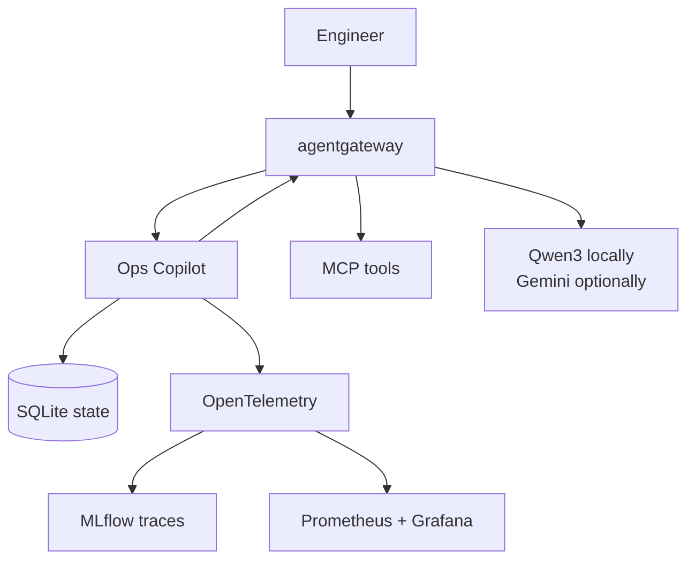

# AgentOps Open Course

Build one **Ops Copilot** from its first model call to an observable Kubernetes workload. Every chapter changes the same runnable repository, so the concepts stay connected to code, tests, policy, and operations.

!!! tip "Start without an account"

    The complete local path uses Ollama and the Apache-2.0 Qwen3 model. Native Gemini is taught as ADK's direct provider path, and the final GKE lab uses Vertex AI as an optional proprietary substrate. The course software remains open source in both paths.

## What will you be able to do?

- Design an agent only where model autonomy is worth its latency and risk.
- Build typed ADK agents with tools, Agent Skills, MCP, memory, workflows, and A2A.
- Test behavior offline, evaluate model-backed trajectories, redact PII, and require human approval for writes.
- Route model, tool, and agent traffic through agentgateway with one stable application contract.
- Run the same container on local k3d or a small GKE lab managed by kagent.
- Trace the system in self-hosted MLflow and monitor it with OpenTelemetry, Prometheus, and Grafana.

## What is the system you will build?

The bundled incident, log, runbook, and skill data is immutable. A runtime copy receives mock state changes and append-only audit records, which keeps each exercise resettable and safe.

## Where should you start?

New to agent systems? Read the chapters in order. Already shipping LLM applications? Use the outcomes below as a map:

| Chapter                                   | You will leave with                                                      |
| ----------------------------------------- | ------------------------------------------------------------------------ |
| [0. Overview](./0.%20Overview/)           | A clear AgentOps lifecycle, architecture, and provider choice.           |
| [1. Setup](./1.%20Setup/)                 | A pinned local workspace and an offline verification checkpoint.         |
| [2. Agents](./2.%20Agents/)               | A first ADK agent with explicit configuration and session semantics.     |
| [3. Capabilities](./3.%20Capabilities/)   | Typed tools, least-privilege skills, MCP, retrieval, workflows, and A2A. |
| [4. Quality](./4.%20Quality/)             | Branch-covered tests, evaluations, guardrails, and security regressions. |
| [5. Gateway](./5.%20Gateway/)             | Governed MCP, A2A, and model traffic through agentgateway.               |
| [6. Platform](./6.%20Platform/)           | Reproducible k3d and optional GKE deployments with kagent.               |
| [7. Observability](./7.%20Observability/) | Self-hosted tracing, metrics, evaluation, feedback, and audit evidence.  |
| [8. Community](./8.%20Community/)         | A maintainable, releasable, and welcoming open-source project.           |

## What does "open source" mean here?

Google ADK, agentgateway, kagent, MLflow, OpenTelemetry, Prometheus, Grafana, Ollama, Qwen3 weights, and the course code are available under open-source licenses. The optional Gemini API, Vertex AI, GKE, and GitHub hosting are proprietary services. They are integrations, not hidden requirements for the local course path.

## How do you begin?

Start with [0.0. Course](./0.%20Overview/0.0.%20Course.md), or go directly to the repository's [local quickstart](https://github.com/MLOps-Courses/agentops-open-course#local-quickstart). Every chapter ends with a checkpoint; Chapters 5-7 also include explicit verification and teardown steps.
