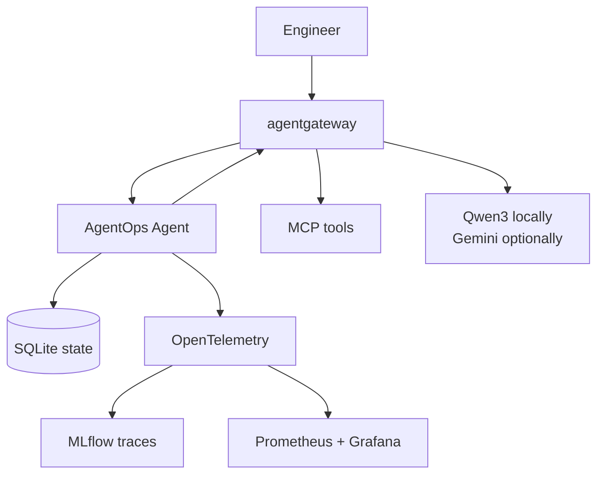
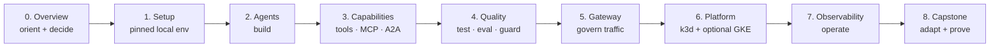

# AgentOps Open Course

Learn from one completed **AgentOps Agent**, from its first local model call to an observable Kubernetes workload. Every chapter inspects and runs the same reference, so concepts stay connected to code, tests, policy, and operations. The capstone then guides you through replacing the fictional incident domain with your own agent platform.

!!! abstract "In one glance"

    - **You will:** Build, test, secure, deploy, and operate one production-shaped AI agent, then replace its domain with your own.
    - **You need:** Linux x86_64, git, and basic Python for the fully supported path. macOS and WSL2 are best-effort. No account, API key, or cloud project is required.
    - **Time:** about 12 to 19 focused hours to read the course and clear each chapter's checkpoint.

## How should you start?

Choose the entry point that matches your current experience:

- **Want to see it work before you read anything?** Take the six commands below. They end in a real agent turn on your own hardware, in about the time the model takes to download.
- **New to agents or AgentOps?** Begin with [0.0. Course](./0.%20Overview/0.0.%20Course.md). Chapter 0 is read-only and helps you decide whether an agent fits your problem.
- **Ready to prepare your machine?** Go to [1.0. System](./1.%20Setup/1.0.%20System.md). Chapter 1 owns installation, local checks, and model setup.
- **Already have the repository and local model ready?** Start the first conversation at [2.1. First Agent](./2.%20Agents/2.1.%20First%20Agent.md).

This separation is intentional. You make the architecture and provider decisions before downloading tools, prove the code offline before adding a model, then run the agent where the course can explain what happened.

Keep [0.7. Glossary](./0.%20Overview/0.7.%20Glossary.md) open when a term is unfamiliar. Use [0.6. Troubleshooting](./0.%20Overview/0.6.%20Troubleshooting.md) only when a command later fails.

## What are the six commands that reach the first agent turn?

You need [mise](https://mise.jdx.dev/) and [Ollama](https://ollama.com/download) on a Unix-like shell. No account, no API key, no `.env`:

<!-- quickstart: unverified-preview -->

!!! warning "This is an unverified preview"

    This shortest path omits `mise run doctor`, `mise run check:core`, and `mise run test`. Use the guarded sequence in [1.0. System](./1.%20Setup/1.0.%20System.md) when any command fails or before trusting the checkout.

```bash
git clone https://github.com/MLOps-Courses/agentops-open-course.git
cd agentops-open-course
mise run install
ollama pull qwen3:4b-instruct
cd agents/python
mise run run
```

Ask `List the open incidents`. A correct run answers with exactly **INC-002, INC-005, and INC-010** — three ids from the committed seed dataset, not three it invented. That is the whole local loop in one turn: a model that reads real data through typed tools and refuses to make one up.

The first turn on CPU can take tens of seconds while the model loads, and a slow local model can exceed the agent's own 60-second deadline — [0.6. Troubleshooting](./0.%20Overview/0.6.%20Troubleshooting.md#why-does-every-model-turn-fail-at-about-60-seconds-on-my-cpu) names the one variable to raise, and how to tell a slow turn from an unreachable model.

`mise run run` prints the answer, not the tool calls behind it. [2.1. First Agent](./2.%20Agents/2.1.%20First%20Agent.md) repeats this run under `mise run web` so you can watch the `list_incidents` call that produced those three ids, and Chapter 2 explains how it is wired.

## What will you be able to do?

- Design an agent only where model autonomy is worth its latency and risk.
- Build typed ADK agents with tools, Agent Skills, MCP, memory, workflows, and A2A.
- Test behavior offline, evaluate model-backed trajectories, redact PII, and require human approval for writes.
- Route model, tool, and agent traffic through agentgateway with one stable application contract.
- Run the same container on local k3d or a small GKE lab managed by kagent.
- Trace the system in self-hosted MLflow and monitor it with OpenTelemetry, Prometheus, and Grafana.

You are not expected to recognize those names yet. Each one gets its own chapter, and the glossary defines every one of them in a single line.

## What is the system you will inspect and extend?


```mermaid
flowchart TD
    User[Engineer] --> Gateway[agentgateway]
    Agent[AgentOps Agent] --> Gateway
    Gateway --> MCP[MCP tools]
    Gateway --> Model[Qwen3 locally<br/>Gemini optionally]
    Gateway --> Agent
    Agent --> State[(SQLite state)]
    Agent --> OTel[OpenTelemetry]
    OTel --> MLflow[MLflow traces]
    OTel --> Metrics[Prometheus + Grafana]
```

**Diagram in words:** An engineer reaches the AgentOps Agent through agentgateway. The gateway brokers the agent's MCP tool and model calls. The agent stores state in SQLite and sends OpenTelemetry to MLflow and to Prometheus/Grafana.

The bundled incident, log, runbook, and skill data is immutable. A runtime copy receives mock state changes and append-only audit records, which keeps each exercise resettable and safe.

You do not reconstruct this system file by file. `main` is the working reference, and each checkpoint asks you to understand, verify, or deliberately change one boundary.

## How does the course progress?

The chapter order is the AgentOps lifecycle: you build the agent, prove it, govern its traffic, deploy it, operate it, then sustain it. Each stage unlocks a heavier prerequisite tier, so nothing forces a model, gateway, cluster, or cloud on you before the chapter that needs it.


```mermaid
flowchart LR
    O["0. Overview<br/>orient + decide"] --> S["1. Setup<br/>pinned local env"]
    S --> A["2. Agents<br/>build"]
    A --> C["3. Capabilities<br/>tools · MCP · A2A"]
    C --> Q["4. Quality<br/>test · eval · guard"]
    Q --> G["5. Gateway<br/>govern traffic"]
    G --> P["6. Platform<br/>k3d + optional GKE"]
    P --> Ob["7. Observability<br/>operate"]
    Ob --> Cm["8. Capstone<br/>adapt + prove"]
```

## Which chapter do you need?

New to agent systems? Read the chapters in order. Already shipping LLM applications? Use the outcomes below as a map:

| Chapter                                   | You will leave with                                                      |
| ----------------------------------------- | ------------------------------------------------------------------------ |
| [0. Overview](./0.%20Overview/)           | A clear AgentOps lifecycle, architecture, and provider choice.           |
| [1. Setup](./1.%20Setup/)                 | A pinned local workspace and a model-free verification checkpoint.       |
| [2. Agents](./2.%20Agents/)               | A first ADK agent with explicit configuration and session semantics.     |
| [3. Capabilities](./3.%20Capabilities/)   | Typed tools, least-privilege skills, MCP, retrieval, workflows, and A2A. |
| [4. Quality](./4.%20Quality/)             | Branch-covered tests, evaluations, guardrails, and security regressions. |
| [5. Gateway](./5.%20Gateway/)             | Governed MCP, A2A, and model traffic through agentgateway.               |
| [6. Platform](./6.%20Platform/)           | Reproducible k3d and optional GKE deployments with kagent.               |
| [7. Observability](./7.%20Observability/) | Self-hosted tracing, metrics, evaluation, feedback, and audit evidence.  |
| [8. Capstone](./8.%20Community/)          | An evidence-backed agent platform of your own, plus optional OSS upkeep. |

Every page opens with the same "In one glance" block — what you will do, what you need first, and how long it takes — and ends with a checkpoint you can actually verify. Skim the glance block and skip a page when it is not for you today.

Those per-page times add up to about 29 hours. That is the figure for running every command on every page, including the optional ones; the 12 to 19 hours above is reading the course and clearing each chapter's checkpoint. Both are honest, and you choose which course you are taking.

## What does "open source" mean here?

Google ADK, agentgateway, kagent, MLflow, OpenTelemetry, Prometheus, Grafana, Ollama, the Apache-2.0 open-weight Qwen3 model, and the course code form the required open-source path. The optional Gemini API, Vertex AI, GKE, and repository/site hosting are proprietary services. They are integrations, not hidden requirements.

## How do you begin?

Start reading at [0.0. Course](./0.%20Overview/0.0.%20Course.md), or enter at the later stage that matches your current setup. Every chapter ends with a checkpoint; Chapters 5-7 also include explicit verification and teardown steps. Finish by adapting the reference through [8.7. Capstone](./8.%20Community/8.7.%20Capstone.md).

The source repository is public at [MLOps-Courses/agentops-open-course](https://github.com/MLOps-Courses/agentops-open-course). To preview documentation changes locally, run `mise run serve` at `http://127.0.0.1:8003`.
